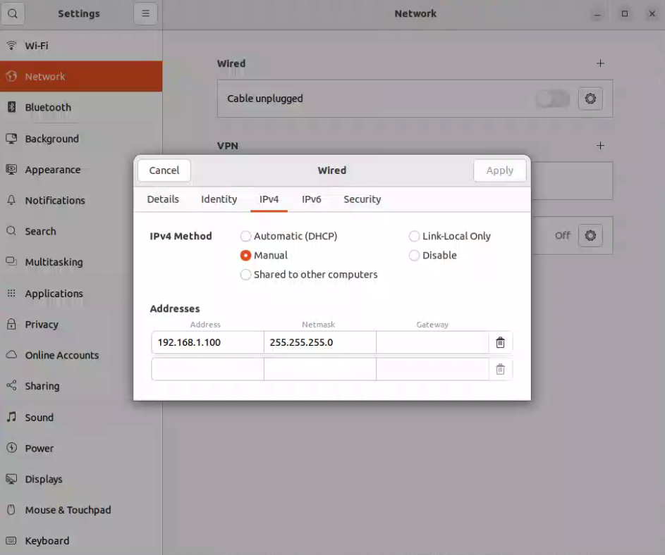

---
last_update:
  date: 2/25/2025
  author: Bingqi
---

# LunarBot Hardware Assembling and Debugging

**This is not a step-by-step tutorial but will definately help you avoid stupid mistakes that you might led to fatal errors and bugs!!**

To assemble the LunarBot from sketch, you need a **chassis body**, **wheels**, **electro board** with servos and other essential components on board, **powering system**, **sensors** that could be customized as you wish, and a **computation module** that could be a nuc running Ubuntu22.04 with enough I/O.

## Wheels to Servos
To connect wheels to servos, we need to take 4 powering cables including U,V,W and PE, 2 powering cables for sensors to $ 24V^+$ and $24V^-$ (or GND), and a signal cable to servo.

Just plug all powering cables from motors to correspond servos following lables on the servo. 

**PAY ATTENTION** to powering cables from origin and limitation sensors from wheels. All $ 24V^+$ cable should be plugged in powering module on electro board, and all $24V^-$ should be **connected to SAME GND RELATIVE TO $24V^+$ of each steering servo**.

Signal cable for origin and limitation sensors could be pluged in multiple "signal-in" slots on **driving servos**, as long as you configure **proper signal-in slot in kinco software for the servo driver**. 

## Servo to Computation Module
All servo should be in series circuit connect by RJ45 cables from "in" to "out" one to another. Last servo in this series provide a RJ45 cable that used to communicate with computation module. Use a certified RJ45 extractor to get CAN_H and CAN_L lines, and then through a USB-CAN converter is an elegant way to let software aware of these cute wheels and servos.

**!!!ATTENTION!!!**

* Look up documents about servos which lines of RJ45 is CAN_H and CAN_L. This must match RJ$% extractor and later match the USB_CAN device.
* **REMEMBER TO SETUP CAN PORTS IN COMPUTATION MODULE BY RUNNNING FOLLOWING COMMANDS**
```bash
sudo ip link set can0 txqueuelen 1000
sudo ip link set can0 up type can bitrate 500000
```

Substitute "can0" with your actural device and correct bitrate.

## Powering Module BUGS

When the auto-initialize process seems in-correct that **wheel is not rotating smoothly**, or **servos keeps powering off automatically** just after powered on, then **IT"S TIME TO JUICE UP THE BATTERY**. Don't believe the capacity indicator on the battery!

## Robot Manipulator and Gripper

The manipulator should be connected to low-voltage power cell with at least 24V and 100 watts power **by 2 wires aeroplane cable**. A RJ45 cable should be connected to computation module for communication.

The gripper should be connected to link 7 (frange) of manipulator by a 5 wire aeroplane cable, this cable is both capable of providing power and transmitting signal.

See [`docs/Manipulator and Gripper.md`](./Manipulator%20and%20Gripper.md) for usage and important notes about manipulator and gripper.


## Computation Module

Make sure all cables are connected correctly.

### Internet Connection

The NUC should be connected to a external wifi card. **DISABLE** the internal wifi card to avoid any conflict by following steps.

1. Determine current network manager of your system (NetworkManager or NetPlan)
```bash
cat /etc/netplan/*.yaml
```
If the yaml is not empty, then NetPlan is the current network manager. Otherwise, the content could be
```yaml
# Current Network Manager is NetworkManager
```
Then make sure NetworkManager is in charge of all network interfaces by:
```bash
nmcli device status
```
And the output is like:
```
DEVICE   TYPE      STATE      CONNECTION
wlpaaaa  wifi      connected  Tsinghua-Secure
wlpbbbb  wifi      connected  Tsinghua-Secure 1
lo      loopback  unmanaged  --
```
2. Determine the name of the internal wifi card. You can unplug the external wifi card and check the output of:
```bash
ifconfig
```
And let's assume the name of the internal wifi card is `wlpaaaa`, and it's connetion is `Tsinghua-Secure`.

3. Disable the internal wifi card by if you're using NetworkManager:
```bash
sudo nmcli connection modify "interface" autoconnect no
sudo nmcli device down "interface"
```
**!!!ATTENTION!!!** that "interface" should be the *CONNETION* name rather than *DEVICE* name.

2. Verify the connection is disabled by:
```bash
nmcli connection status
```
And the output should be like:
```
DEVICE   TYPE      STATE      CONNECTION
wlpaaaa  wifi      disconnected  --
wlpbbbb  wifi      connected  Tsinghua-Secure 1
lo      loopback  unmanaged  --
```


### Ethernet Connection with Realman Robot Manipulator

As the manipulator is connected to the NUC via Ethernet, you need to configure the Ethernet connection manually to avoid conflict with the wifi connection. 

1. Configure the ip address by Ubuntu Setteings->Network->Wired->IPV4 Settings->Manual. and set the ip address to `192.168.1.100`, subnet mask to `255.255.255.0`, and gateway to `192.168.1.1`.



2. Configure Static IP for the Ethernet Interface and make sure ethernet is NOT the default connection.
```bash
nmcli connection modify "Wired-Connection-1" ipv4.addresses 192.168.1.100/24 ipv4.method manual
nmcli connection modify "Wired-Connection-1" ipv4.gateway ""
```

3. Configure WiFi for General Network Traffic.
```bash
nmcli connection modify "WiFi-Connection-1" ipv4.method auto
```

4. Configure the Ethernet connection to manipulator and turn on the connection.
```bash
nmcli connection modify "ethernet interface name" +ipv4.routes "192.168.1.0/24 192.168.1.1"
nmcli connection up "ethernet interface name" 
```
