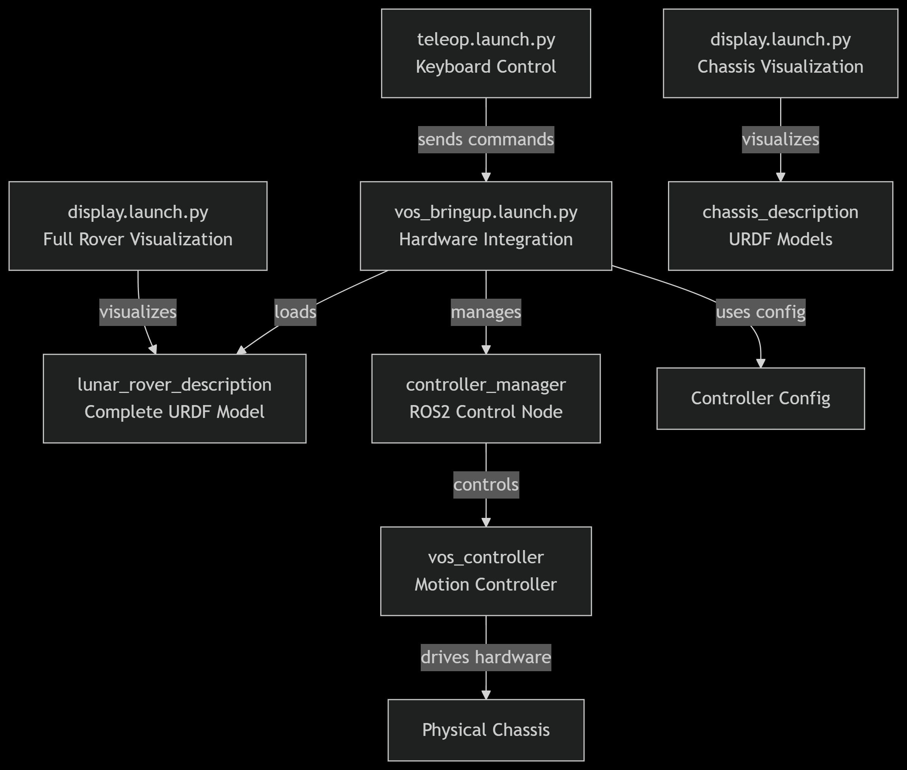
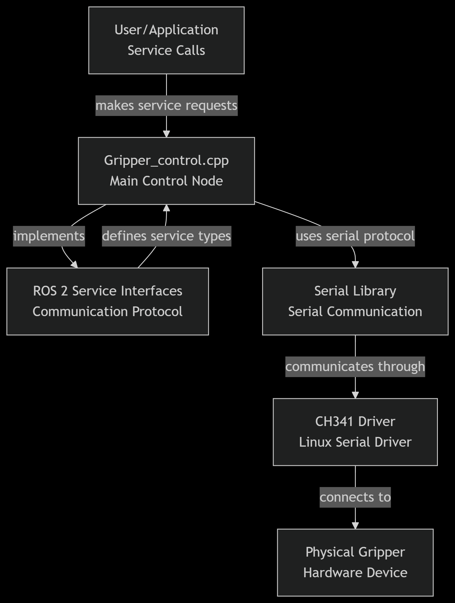
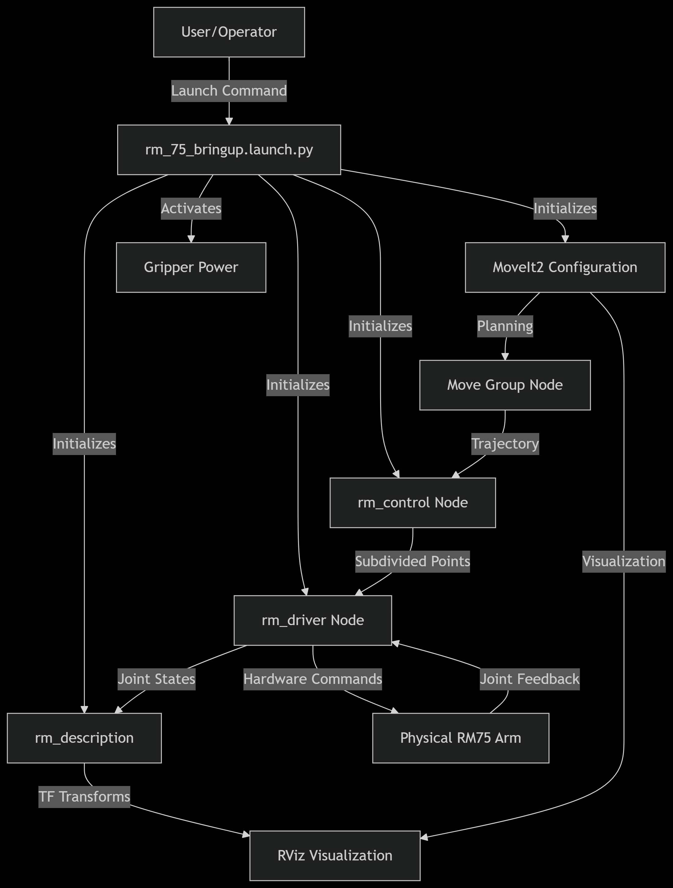
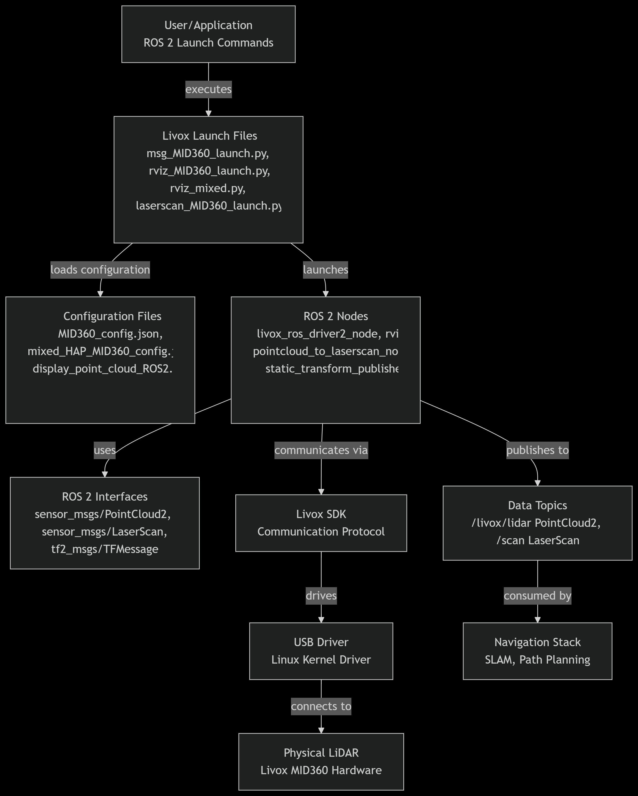

---
last_update:
  date: 2/25/2025
  author: Bingqi
---

# LunarBot Hardware Introduction
LunarBot is the **fundamental** unit of a lunar service robot cluster. 

The LunarBot is built on a **4-wheeled independent steering and driving platform**, each wheel features a driving motor and steering motor with encoders. It is equipped with a multi-modal perception system that integrates a Livox-Mid360 360° LiDAR, a Intel Realsense D435i camera and IMU integrated in it. Realman RM-75, a 7-degrees-of-freedom (7-DOF) robotic manipulator, with a 2-finger gripper as end effector, is also integrated.


## Geometric Information

The rover is approximetly 1300mm length, 1000mm width and 800mm height without solar pannels and manipulator. All wheels' $\Phi= 260mm $ (without EVA foam) and $width = 168mm$.

## Components

Current LunarBot is a 4 wheel model.

### Wheels

Each wheels is equipped with: 

  * A 100 Watts steering motor with encoder
  * A 200 Watts driving motor with encoder
  * 1 origin indicator sensor (npn switch)
  * 1 limitaion indicator sensor (npn switch)
  * 2 servos, for each motor
  * Steering and driving motor gear box

Except servos are installed in chassis body, all other components are exposed at each wheel.

### Chamber

Inside the chamber of the chassis, we got:

  * A high-voltage graphene power cell
  * A low-voltage graphene power cell
  * 8 servos
  * Circuit breakers
  * Computation Module

### Sensors

  * Livox-Mid360 LiDAR
  * Intel Realsense D435i Camera
  * IMU

### Manipulators

  * Realman RM-75 robot manipupator, 7-dof
  * Inspire Robots EG2-4C gripper

## Chassis Hardware
The LunarBot's chassis system provides the complete control and visualisation infrastructure for the lunar rover's mobility platform. The programs work together to create a robust ROS 2 control system that handles everything from the user input to physical motor control.

### Working Principle
#### Startup Sequence
  1. The system loads the appropriate URDF model 
  2. ROS 2 control node stars with configuration parameters
  3. `vos_controller` is spawned to manage motion control
  4. The robot and joint states are published for visualisation and control
  
#### Control FLow
  1. The user enters a keyboard comman that generates Twist messages via `teleop.launch.py`
  2. `vos_controller` receives and processes velocity commands
  3. The commands are converted to individual wheel velocities and steering angles
  4. The processed commands are sent to the physical motors and actuators
  5. Joint states are monitored and published back to the system

#### Operational Modes
The LunarBot comes with three operational modes as described below:
  1. Manual Control: Keyboard teleoperation for direct user control
  2. Autonomous Operation: Accepts commands from autonomous systems
  3. Visualisation Only: Display mode without hardware connection for testing

### Launch Files
The Chassis Hardware of the LunarBot is developed using various launch files. This section describes each launch file and its functions.

#### (1) Control Interface (teleop.launch.py)
**Provides keyboard-based teleoperation control**
  * Launches the `teleop_twist_keyboard` node for manual control
  * Publishes velocity commands to `/cmd_vel` topic
  * ENables real-time manual control of the rover's movement

#### (2) Visualisation System (display.launch.py)
  1. Dual Configuration:
    * Chassis-only visualisation: Display just the chassis components
    * Full rover visualisation: Shows complete lunar rover with all systems
  2. Key Components:
    * Robot State Publisher: Converts URDF models to TF transforms
    * Joint State Publisher: Handle both GUI and non-GUI joint visualisation
    * RViz Integration: Provides 3D visualisation of the robot model

#### (3) Hardware Integration (vos_bringup.launch.py)
  * Loads the complete lunar rover URDF model from `lunar_rover_description`
  * Initialises the ROS 2 control node with controller configuration
  * Manages the `vos_controller` for motion control
  * Handles joint state broadcasting and robot state publication

### Summary of Chassis Hardware
This integrated system ensures reliable control of the lunar rover chassis while providing comprehensive visualisaition and monitoring capabilities for both development and operational use. Below is an image showing the relations of the chassis program files:


## Gripper Hardware
The gripper hardware system provides complete control and monitoring capabilities for the lunar rover's robotic gripper. This system uses a CH341-based USB-to-RS485 converter to communicate with the gripper hardware and provides a comprehensive ROS 2 service interface for control and status monitoring.

### Working Principle
#### Communication Protocol
The system uses a custom binary protocol over RS485:
  * Message Format: 0xEB 0x90 header followed by device ID, length, command, data, and checksum
  * Checksum Calculation: Sum of bytes from position 2 to len-1
  * Response Handling: 0x01 indicates success, other values indicate errors

#### Control Flow:
  1. Service Request: ROS 2 client makers service call to gripper control node
  2. Protocol Encoding: Node converts service request to binary protocol format
  3. Serial Transmission: Message sent via serial library to CH341 device
  4. Hardware Communication: CH341 converts USB to RS485 for gripper communication
  5. Response Processing: Node waits for response and decodes results
  6. Service Response: Node returns appropriate response to client

#### Operational Modes:
  1. Position Control: Move to specific opening positions
  2. Speed Control: Control movement speed for opening/closing
  3. Force Control: Adjust gripping force for delicate operations
  4. Emergency Stop: Immediate halt of all movements
  5. Status Monitoring: Real-time monitoring of position, status, and errors

### Component Functions
#### (1) Main Control Node (Gripper_control.cpp)
**Provides ROS 2 service interface for gripper control and monitoring**
The Control Services include the following:
  * SetID: Configure gripper device ID
  * Setopenlimit: Set maximum and minimum opening limits
  * Setclearerror: Clear error states and faults
  * Setmovetgt: Move to specific target position 
  * Setmovemax: Open gripper at specified speed
  * Setmovemin: Close gripper with speed and force control
  * Setmoveminhold: COntinuous gripper with force control
  * Setestop: Emergency stop function
  * Setparam: Parameter saving to non-volatile memory

The Monitoring Services include the following:
  * Getopenlimit: Read current opening limits
  * Getcopen: Read current gripper opening position
  * Getstatus: Read operational status, error codes, and temperature

### (2) Serial Communication Driver (CH341SER_LINUX)
**Linux kernel driver for CH340/CH341 USB-to-serial chips**
  * Supports USB VID 1a86 devices
  * Creates `/dev/ttyCH341USBx` devices for communication
  * Provides RS485 serial communication capability
  * Requires manual installation and permissions configuration

### (3) Serial Library Dependency
**ROS 2-compatible serial communication library**
Installation:
`git clone https://gitee.com/laiguanren/serial.git`

### (4) Installation and Setup
#### Driver Installation
`cd CH341SER_LINUX/driver`
`make`
`sudo make install`

#### Permission Configuration
`sudo apt remove brltty  # Remove conflicting braille display package`
`sudo chmod 777 /dev/ttyCH341USB0  # Set appropriate permissions`

#### Serial Library Setup
Clone and build the required serial library for ROS 2 compatibility

### Troubleshooting 
**Common Issues:**
  * "serial unable to open": Check permissions on `/dev/ttyCH341USB0`
  * Device not found: Verify driver installation and cable connection
  * No response from gripper: Check RS485 wiring and power supply

**Diagnostic Commands:**
`lsusb | grep 1a86  # Check if device is detected`
`dmesg | grep ch341  # Check kernel messages for driver issues`
`ls /dev/ttyCH341*  # Verify device node creation`

### Summary of Gripper Hardware
The gripper hardware inetgrated system provides reliable control of the LunarBot's gripper mechanism with comprehensive monitoring and safety features, enabling precise manipulation tasks in the lunar environment.



## LunarBot Hardware System
The LunarBot's hardware system integrates multiple subsystems through a comprehensive bringup system and message bridging architecture. THis system coordinates the chassis, robotic arm, gripper, and  sensor systems to function as a unified robotic platform.

### Working Principle
#### Startup Sequence
  1. `lunar_rover_hardware_bringup.launch.py` acts as the master launch file by initialising all subsystems
  2. The hardware such as achassis, arm, and sensors are brought online
  3. Message bridges begin and connections are established
  4. If all things goes well, all components report successful initialisation

#### Control FLow
##### Gripper Operation
  1. The user sends gripper position commands through a remote control
  2. The gripper bridge receives and converts commands
  3. RM driver executes the gripper movement
  4. Status feedback is received as the gripper position and status are monitored.

##### Arm Trajectory Execution
  1. MoveIt2 plans and publishes joint trajectories 
  2. Trajectory bridge converts topic messages to action goals
  3. RM controler executes the trajectory on hardware
  4. Feedback provides real-time execution status for progress monitoring

### Component Functions
#### (1) Master Bringup System (lunar_rover_hardware_bringup.launch.py)
**This is the main launch file that manages all harware components**

##### Integrated Subsystems
  * Chassis System: Controls rover mobility and navigation
  * Robotic Arm System: Manages the RM75 robotic arm operations
  * Sensor System: Handles RealSense camera data acquisition
  * Gripper System: Controls end-effector manipulation

##### Configuration
  * Initialises all hardware interfaces simultaneously
  * Sets appropriate namesapce and parameter configurations
  * Manages sensor settings (pointcloud enablement, camera alignment)

#### (2) Message Bridge System 
##### Gripper Bridge Node (gripper_bridge_node.cpp)
**Translates simple gripper commands to RM controller format**
  * Subscribes to `/remote_grippper_cmd` topic (UInt16 messages)
  * Converts to RM gripper interface format (/rm_driver/set_gripper_position_cmd)
  * Maintains compatibility between different control systems
  * Provides block/no-block functionality for gripper operations

##### Trajectory Bridge Node (trajectory_bridge_node.cpp)
**Bridges MoveIt2 trajectory topics to RM controller action server**
  * Solves Compatibility Issue: MoveIt2 publishes trajectories via topics while RM controller expects action goals
  * Real-time Translation: Converts trajectory_msgs/JointTrajectory to FollowJointTrajectory action goals
  * Status Monitoring: Provides feedback and result callbacks for trajectory execution
  * Error Handling: Manages action server availability and response codes

### Usage Instructions
Starting the complete system:
`ros2 launch hardware_bringup lunar_rover_hardware_bringup.launch.py`

Manual Component Testing:
```
# Test gripper control
ros2 topic pub /remote_gripper_cmd std_msgs/msg/UInt16 "{data: 1000}"

# Monitor trajectory execution
ros2 action list
ros2 topic echo /rm_group_controller/feedback
```
### Troubleshooting
#### Common Issues
  1. Action Server Not Available: Check RM controller initialization
  2. Gripper Not Responding: Verify USB connections and permissions
  3. Trajectory Execution Fails: Check joint limits and collision constraints

Diagnostic Commands
```
# Check bridge operation
ros2 node info /gripper_relay_node
ros2 node info /trajectory_bridge_node

# Monitor communication
ros2 topic hz /remote_gripper_cmd
ros2 action send_goal /rm_group_controller/follow_joint_trajectory <trajectory>
```

### Summary of LunarBot Hardware System
This integrated system provides a robust framework for controlling the lunar rover's complex hardware systems, enabling both manual teleoperation and autonomous operation through seamless communication between high-level planning and low-level hardware control.


## Robotic Arm System
The LunarBot's robotic arm system integrates an RM75 industrial robotic arm with MoveIt2 motion planning framework to provide advanced manipulation capabilities. This system enables both simulated and real-world arm operation through a comprehensive configuration and launch system.

### Working Principle
#### System Architecture
The robotic arm system follows a layered architecture:
  1. Hardware Interface Layer: Direct communication with RM75 arm hardware through `rm_driver`
  2. Motion Planning Layer: MoveIt2 for trajectory planning and execution via `rm_moveit2_config`
  3. Control Layer: Intermediate trajectory processing through `rm_control`
  4. Visualization Layer: RViz for monitoring and robot state display via `rm_description`
  5. Simulation Layer: Gazebo integration for testing and development

#### Control Flow
##### Trajectory Execution
  1. Path Planning: MoveIt2 computes collision-free trajectories
  2. Trajectory Processing: rm_control subdivides and processes trajectories
  3. Hardware Execution: rm_driver sends commands to physical hardware
  4. Feedback Monitoring: Joint states are monitored for execution status



### Component Functions
#### (1) Master BRinguip System (rm_75_bringup.launch.py)
**Main launch file that orchestrates all robotic arm components**
Integrated components:
  * rm_driver: Hardware interface for RM75 arm
  * rm_description: Robot model and TF transformation
  * rm_control: Trajectory processing and control
  * MoveIt2: Motion planning framework
  * Gripper Initialization: Powers up the gripper system

Key features:
  * Single command startup for entire arm system
  * Proper component initialization sequence
  * Gripper power management
  * Coordinated subsystem activation

#### (2) RM Driver System
**Hardware interface for the RM75 robotic arm**
Core Functionality: 
  * Direct communication with RM75 controller
  * Joint state publishing (`/joint_states`)
  * COmmand execution (`/rm_driver/movej_candf_cmd`)
  * Error handling and status monitoring

Configuration:
  * YAML configuration files for arm parameters
  * Support for multiple RM arm models (63, 65, 75 eco63, eco65, gen72)
  * Six-axis force sensor integration options

#### (3) Control System (rm_control)
**Intermediate trajectory processing between MoveIt2 and hardware**
Key Functions:
  * Trajectory subdivision and interpolation
  * Cubic spline interpolation for smooth motion
  * Follow mode selection (high/low following)
  * Action server for MoveIt2 integration

Parameters:
  * `follow`: High/low following mode selection
  * `arm_type`: Specific arm model configuration
  * Trajectory smoothing and filtering options

#### (4) Description System (rm_description)
**Robot model visualisation and TF management**
Components:
  * URDF/XACRO model files for all arm variants
  * RViz configuration files
  * STL mesh files for realistic visualization
  * TF transformation management

Supported Arm Models:
  * RM63, RM65, RM75 series
  * ECO63, ECO65 economical series
  * GEN72 collaborative series
  * Six-axis force sensor variants

#### (5) MoveIt2 Configuration (rm_moveit2_config)
**Motion planning framework configuration**
Configuration Files:
  * SRDF: Semantic Robot Description Format
  * Kinematics: IKFast/KDL solver configuration
  * Joint Limits: Physical joint constraints
  * RViz Config: MoveIt2 visualization settings

Operational Modes:
  * Demo Mode: Virtual arm control
  * Real Mode: Physical arm control
  * Gazebo Mode: Simulation environment
  * Six-Axis Force Mode: Force feedback control

### Usage Instructions
#### Starting the Complete System
```
# Full system startup (recommended)
ros2 launch rm_hardware rm_75_bringup.launch.py

# Individual component testing
ros2 launch rm_driver rm_75_driver.launch.py
ros2 launch rm_description rm_75_display.launch.py
ros2 launch rm_control rm_75_control.launch.py
ros2 launch rm_75_config real_moveit_demo.launch.py
```

#### Simulation vs Real Operation
```
# Real hardware operation
ros2 launch rm_hardware rm_75_bringup.launch.py

# Gazebo simulation
ros2 launch rm_hardware rm_75_gazebo.launch.py

# MoveIt2 demo (virtual only)
ros2 launch rm_75_config demo.launch.py
```

#### Advanced Configuration
Six-Axis Force Sensor Models:
```
# Six-axis force sensor version
ros2 launch rm_hardware rm_75_6f_bringup.launch.py

# Integrated six-axis force version
ros2 launch rm_hardware rm_75_6fb_bringup.launch.py
```

Different Arm Models
```
# Various supported models
ros2 launch rm_hardware rm_65_bringup.launch.py
ros2 launch rm_hardware rm_eco65_bringup.launch.py
ros2 launch rm_hardware rm_gen72_bringup.launch.py
```

### Operational Modes
#### (1) Real Hardware Mode
  * Direct control of physical RM75 arm
  * Hardware safety monitoring
  * Real-time joint feedback
  * Production deployment

#### (2) Simulation Mode
  * Gazebo physics simulation
  * Safe for testing and development
  * No hardware requirements
  * Full MoveIt2 functionality

#### (3) Demonstration Mode
  Pre-configured scenarios
  Educational and testing purposes
  Virtual arm operation only

### Integration with Lunar Rover
#### (1) Coordinate Frame Management
  * Arm base frame connected to rover chassis
  * End effector frame for tool mounting
  * Camera and sensor frame integration
  * World frame for global positioning

#### (2) Navigation Integration
  * Arm stowing during rover movement
  * Collision avoidance with environment
  * Coordinated motion with rover base
  * Sensor-based adaptive manipulation

### Message Interface
#### Key Topics and Services
Control Topics:
  * `/rm_driver/movej_canfd_cmd`: Joint position commands
  * `/joint_states`: Current joint positions feedback
  * `/rm_group_controller/follow_joint_trajectory`: MoveIt2 action interface

Status Topics:
  * `/tf` and `/tf_static`: Coordinate transformations
  * `/robot_description`: URDF model information
  * Various diagnostic and status topics

### Troubling 
#### Common Issues
##### (1) Driver Connection Problems
```
# Check USB permissions
ls -l /dev/ttyUSB*
# Verify driver parameters
ros2 param list /rm_driver
```

##### (2) MoveIt2 Planning Failures
```
# Check planning scene
ros2 topic echo /planning_scene
# Verify kinematics
ros2 service call /compute_ik <service_type>
```

##### (3) TF Configuration Issues
```
# Check TF tree
ros2 run tf2_tools view_frames.py
# Verify frame connections
ros2 topic echo /tf
```

#### Diagnostic Commands
```
# System status check
ros2 node list
ros2 topic list

# MoveIt2 debugging
ros2 action list
ros2 topic echo /move_group/status

# Hardware verification
ros2 topic echo /joint_states
ros2 service call /rm_driver/get_status <service_type>
```

### Summary of Robotic Arm System
The RM75 robotic arm system provides the Lunar Rover with sophisticated manipulation capabilities through a well-integrated architecture combining MoveIt2 motion planning with robust hardware interfaces. The system's modular design allows flexible deployment across simulation, testing, and operational environments while maintaining the safety and reliability standards essential for lunar exploration missions.

The comprehensive bringup system (`rm_75_bringup.launch.py`) serves as the central coordination point, ensuring all components are properly initialized and configured for seamless operation. This architecture enables both autonomous operation and manual teleoperation through a consistent interface that abstracts the complexity of the underlying hardware system.

## Sensor Hardware
The LunarBot's sensor hardware system integrates the Livox MID360 LiDAR sensors with ROS 2, enabling 3D perception, mapping, and navigation. These launch files coordinate the LiDAR drivers, data processing nodes, and visualization tools so that the rover perceives its surroundings in real-time.

### Working Principle
#### Startup Sequence
  1. The selected `*_MID360_launch.py` file is launched, initialising the Livoc LiDAR driver with user-defined parameters.
  2. The driver starts publishing PointCloud2 data representing the rover's environment.
  3. Depending on the launch file, the data is either:
    * Converted into LaserScan messages for 2D navigation (`laserscan_MID360_launch.py`)
    * Published directly as raw PointCloud2 messages (`msg_MID360_launch.py`)
    * Displayed in RViz for 3D visualisation (`rviz_MID360_launch.py`, `rviz_mixed.py`)
  4. Other rover subsystems (chassis, navigation stack, localization) subscribe to these topics to enable obstacle avoidance, SLAM, and motion planning.

#### Control Flow
##### LiDAR Data Processing
  1. LiDAR driver (`livox_ros_driver2_node`) acquires raw sensor data.
  2. Data is converted into ROS 2 messages (PointCloud2 or LaserScan) depending on the configuration
  3. Processed data is sent to the navigation system for:
    * Mapping the lunar surface
    * Detecting obstacles in real-time
    * Supporting autonomous navigation

##### Visualisation in RViz
  1. When `rviz_MID360_launch.py` or `rviz_mixed.py` is launched, an RViz instance automatically starts
  2. It loads a predefined configuration file to visualise point clouds or scans
  3. Engineers can monitor sensor coverage, adjust parameters, and debug rover navigation

### Component Functions
#### (1) LiDAR-to-LaserScan Conversion (laserscan_MID360_launch.py)
**Converts dense 3D point clouds into 2D laser scans for navigation stacks**
  * Starts the Livox driver to publish `/livox/lidar` pointclouds
  * Launches the pointcloud_to_laserscan node that projects 3D points into a planar LaserScan message on `/scan`
  * Configurable parameters include angle limits, height filters, and range filters

#### (2) PoitnCloud Publisher (msg_MID360_launch.py)
**Publishes raw LiDAR point clouds for 3D mapping and perception**
  * Runs only the Livox driver.
  * Data is streamed as PointCloud2 messages (e.g., /livox/lidar).
  * Used when the rover requires 3D environment representation instead of 2D scans

#### (3) RViz Visualisation (rviz_MID360_launch.py)
**Provides real-time 3D visualization of LiDAR data**
  * Runs both the Livox driver and an RViz instance
  * Loads a preconfigured RViz display (display_point_cloud_ROS2.rviz)
  * Engineers can see live LiDAR point clouds and monitor sensor performance during testing

#### (4) Mixed Configuration Visualization (rviz_mixed.py)
**Similar to rviz_MID360_launch.py but uses a different configuration file (mixed_HAP_MID360_config.json)**
  * Designed for scenarios where multiple sensors or hybrid configurations are active.
  * Allows monitoring of integrated sensor setups for robust lunar navigation

### Usage Instructions
#### Starting Individual Components
```
# Basic LiDAR data acquisition
ros2 launch sensor_hardware msg_MID360_launch.py

# LiDAR with visualization
ros2 launch sensor_hardware rviz_MID360_launch.py

# Multi-LiDAR setup
ros2 launch sensor_hardware rviz_mixed.py

# LiDAR with laser scan conversion
ros2 launch sensor_hardware laserscan_MID360_launch.py
```
#### Monitoring Data Streams
```
# View point cloud data
ros2 topic echo /livox/lidar

# Monitor laser scan data
ros2 topic echo /scan

# Check TF frames
ros2 run tf2_tools view_frames.py
```

### Troubleshooting
#### Common Issues
  1. No Point Cloud Data: Check LiDAR power and network connections
  2. TF Frame Errors: Verify frame_id consistency across configurations
  3. RViz Display Issues: Confirm RViz configuration file path is correct
  4. LaserScan Conversion Problems: Check height and angle parameters match your environment

#### Diagnostic Commands
```
# Check node status
ros2 node list
ros2 node info /livox_lidar_publisher

# Monitor topic activity
ros2 topic hz /livox/lidar
ros2 topic hz /scan

# Verify TF tree
ros2 run tf2_ros tf2_echo map laser
```

#### Configuration Validation
```
# Check parameter values
ros2 param list /livox_lidar_publisher
ros2 param get /livox_lidar_publisher frame_id
```

### Summary of Sensor Hardware System
This sensor system provides comprehensive 3D perception capabilities for the lunar rover through Livox MID360 LiDAR technology. The modular launch system allows flexible deployment configurations from basic data acquisition to full navigation-ready processing pipelines. The system supports single and multi-LiDAR setups with appropriate coordinate frame management and data conversion for integration with the rover's navigation stack.
