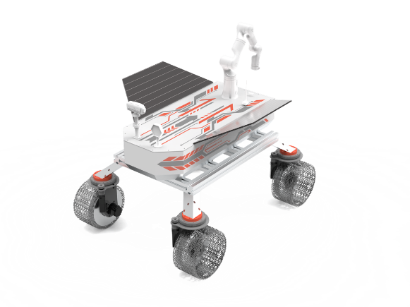
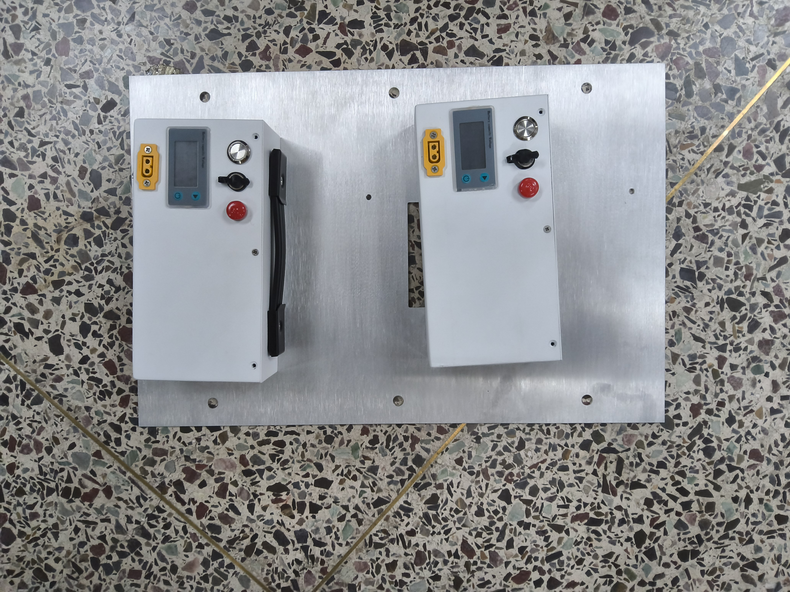
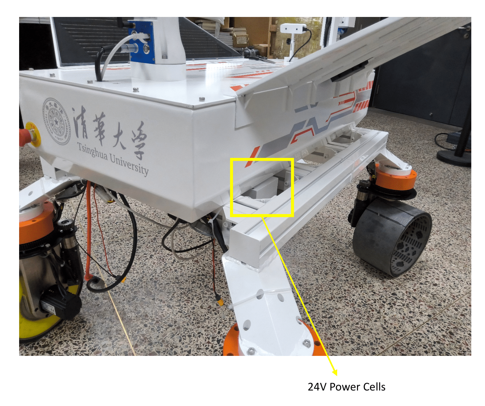
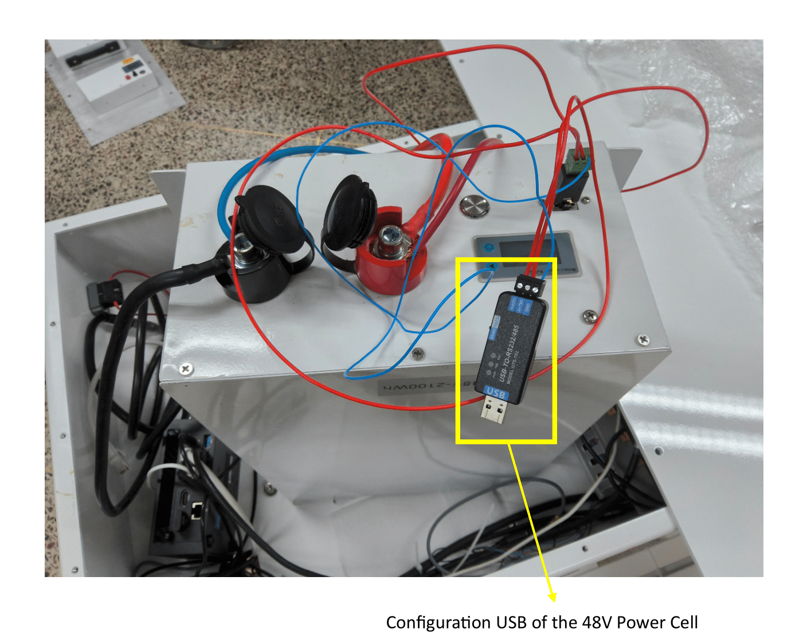
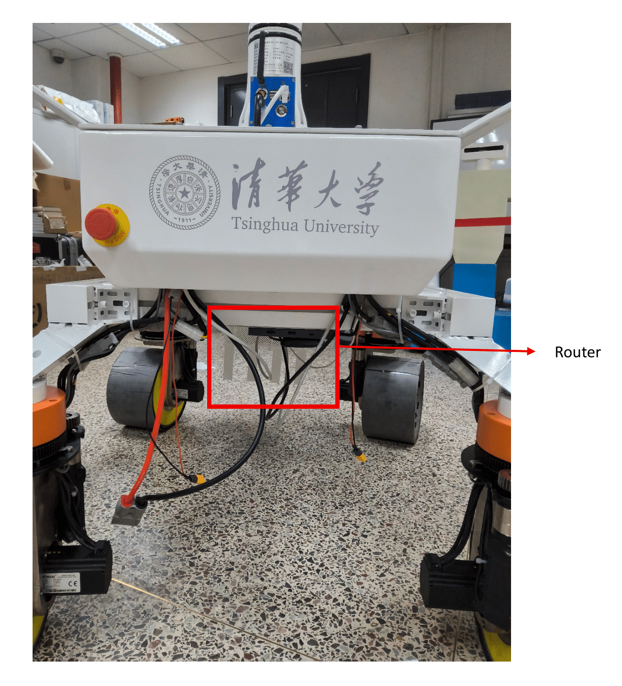
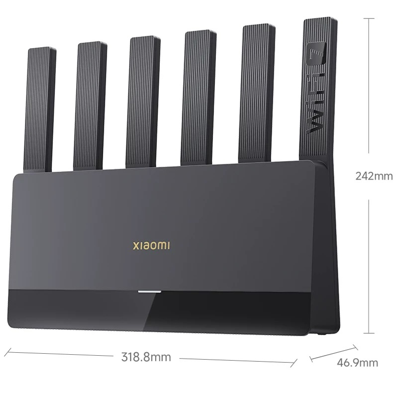
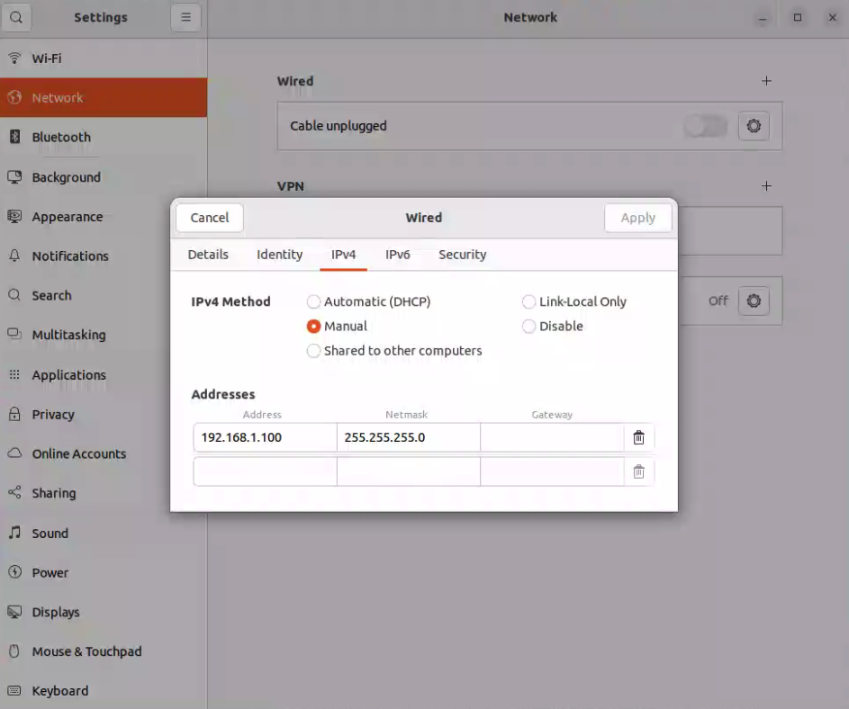

---
last_update:
  date: 09/22/2025
  author: Isaac
---

# LunarBot User Manual

# Preface 
Thank you for choosing the LunarBot Robotic Rover. This manual provides comprehensive instructions for the assembly, operation, and maintenance of the LunarBot. Developed by the Distributed and Intelligent Space Systems Lab (DSSL) at Tsinghua University, the LunarBot is an uncrewed robotic rover designed for lunar surface exploration, data collection, and terrain imaging. It features a rugged four-wheeled chassis with independent steering and drive on each wheel, a multi-modal sensor suite, and a 7-degree-of-freedom robotic arm for manipulation tasks.


<br>
*Figure 1: The LunarBot Conceptual Design Rendering*


<br>
*Figure 2: LunarBot Prototype Rover*

**Key Features**: The LunarBot integrates advanced mechanisms and systems to enable reliable operation in harsh environments:
- All-Terrain Mobility: Four-wheel independent steering and driving allow omnidirectional movement and precise positioning on challenging terrain.
- Advanced Perception: A fusion of LiDAR and stereo camera sensors (with IMU) provides high-resolution 3D mapping, visual odometry, and obstacle detection for autonomous navigation.
- Robotic Manipulation: A 7-DOF robotic arm (Realman RM-75) with a 2-finger gripper (Inspire EG2-4C) extends the rover’s capabilities to sample collection and environment interaction.
- Robust Power System: Dual graphene-based battery packs (48 V high-voltage and 24 V low-voltage) provide reliable, extended power, with safety features to prevent deep discharge.
- Modular Control: An onboard computation module runs ROS 2 for sensor processing and motion control, communicating with motor servo drivers and the manipulator over dedicated networks.

This manual is organized into chapters covering Safety, Installation, IP Configuration and Network Setup, Operation, Maintenance, Troubleshooting, and Technical Specifications, followed by an Appendix with additional resources. It is intended for engineers and integrators with basic mechanical and electrical knowledge. Please read the Safety instructions in Chapter 1 carefully before proceeding with installation or operation.
<br/>

# 1. Safety
Operating the LunarBot involves electrical power systems, moving mechanical parts, and wireless networking. This chapter contains important safety guidelines that must be followed to ensure personal and equipment safety.

## 1.1 Electrical and Power Safety
- Power Off Before Wiring: Always switch off all power sources (batteries) before making or modifying any electrical connections. Disconnect the 24 V and 48 V batteries when performing assembly or maintenance to prevent accidental energizing.
- Correct Voltage and Polarity: Verify that all components are rated for the supplied voltages. Ensure the 24 V and 48 V power lines are connected to the correct terminals with proper polarity. Use only the specified graphene battery packs or equivalents.
- Secure Connections: Double-check that every power cable, connector, and terminal is firmly attached and secured. Loose connections can cause arcing, erratic behavior, or damage. Ensure all ground (GND) connections are common and reliable to avoid ground loops.
- Prevent Short Circuits: Route cables neatly and away from any sharp edges or moving parts. Use proper insulation on all wiring. Install the provided circuit breakers/fuses and ensure they are of the correct rating to protect against overcurrent.
- Battery Handling: The battery packs should be handled according to manufacturer guidelines. Do not short the terminals. The 48 V high-voltage battery includes a configuration USB interface that can shut off output after a period of inactivity to prevent deep discharge – use this feature to prolong battery life. Charge batteries only with approved chargers and monitor their status indicators.

## 1.2 Operational Safety
- Environmental Awareness: Operate the LunarBot in a clear, open area whenever possible. Remove any unnecessary personnel or obstacles from the rover’s immediate operating vicinity. The manipulator arm should have a clear workspace; ensure no one is within the arm’s reach during movement.
- Personal Safety Distance: Maintain a safe distance from the rover while it is powered on, especially when the motors or manipulator are active. Never place any body parts near the wheels, suspension, or gripper when the system is energized.
- Joystick Control Caution: When using the wireless joystick, always test the controls in an open space at low speeds. Avoid sudden or erratic joystick commands that could cause unpredictable rover motion. Do not stand in front of or behind the rover during remote operation.
- Emergency Stop: Be prepared to perform an emergency stop. In an emergency, immediately cut power by turning off both 24 V battery packs (which will disable the chassis and arm). The gripper’s low-level driver also provides a software E-stop service (Setestop) – see Appendix for advanced usage – but the primary E-stop method is to disconnect power.
- Manipulator Usage: Only operate the robotic arm when the rover is on stable, level ground. Ensure the arm’s path is clear of obstacles. The arm should be operated at slow speeds when near people or delicate equipment. Follow all manufacturer safety instructions from the Realman RM-75 manual regarding joint limits and payloads.
- Electrical Equipment: Follow standard electrical safety protocols. Use proper personal protective equipment if working on live circuits. If the rover must be powered on for debugging, use caution and keep clear of moving parts.
- Thermal Considerations: The motors, servos, and electronic components can become hot during operation. Allow the rover to cool down before touching motors, servo drivers, or the power converter units after use.

By adhering to these safety precautions, operators and bystanders can greatly reduce the risk of injury and prevent damage to the LunarBot hardware. Always prioritize safety and when in doubt, disconnect power and revisit the setup.
<br/>

# 2. Installation
This chapter guides you through the hardware installation and assembly of the LunarBot, including mechanical assembly of the chassis, electrical wiring of motors and servos, connecting the robotic arm, and initial software setup. Ensure that you have all components on hand and follow the instructions in order.

## 2.1 Chassis Assembly
The LunarBot’s chassis is the main body that houses batteries, electronics, and supports the wheels and manipulator. This section covers the installation of the power cells and the onboard networking hardware on the chassis.

### 2.1.1 24V Power Cells
The LunarBot uses two 24 V graphene battery packs as its low-voltage power source (for the chassis electronics and manipulator). The two 24 V power cells should be placed side-by-side, as shown in Figure 3. Mount these battery packs securely to the bottom-rear area of the chassis frame (the designated battery bay) as illustrated in Figure 4. Use the provided brackets or straps to hold the batteries in place so they do not shift during rover motion.


*Figure 3: Two 24 V power cells (low-voltage batteries) side by side*


*Figure 4: Installation location of the 24 V power cells at the rear underside of the chassis*

After installing, connect the output leads of the 24 V batteries to the rover’s power distribution system as instructed (but do not turn them on until the installation is complete and all components are connected, as per the Operation chapter). Each 24 V battery typically supplies the drive servos and on-board computer; having two in parallel or dedicated to different subsystems can increase the available current capacity.

### 2.1.2 48V POwer Cells
The high-voltage power source for the drive motors is a single 48 V graphene battery pack. Install the 48 V power cell inside the chassis compartment designed to house it. Ensure it is firmly seated and the wiring is routed safely. The 48 V battery includes a USB configuration interface (seen in Figure 5) which can be used to program the battery’s internal management system – for example, setting an auto-shutdown timer to cut off power after a period of inactivity, to prevent the battery from over-discharging. If required, connect this configuration port to a PC and use the manufacturer’s software to adjust settings (refer to the battery manual). Once configured, connect the 48 V battery output to the rover’s power input (high-voltage line for motor drivers), but keep it switched off until final power-on.


*Figure 5: Configuration USB interface of the 48 V power cell (for setting auto-shutdown, etc.)*

### 2.1.3 Onboard Router Installation
Each LunarBot is equipped with an onboard Wi-Fi router mounted inside the chassis (typically at the bottom of the rover, see Figure 6). Install the router in its designated spot and secure it with screws or velcro as provided. This router serves as the communication hub for the rover’s local network: it assigns IP addresses and manages data exchange between the onboard devices – such as the navigation computer (NUC), LiDAR, and camera – and also enables connectivity between multiple rovers. Ensure the router’s antennas (if external) are properly attached and oriented for optimal signal coverage. 


*Figure 6: Onboard Wi-Fi router mounted on the LunarBot chassis*


*Figure 7: LunarBot router*

In a multi-rover setup, each rover has its own router, and a separate base station router (or dedicated hotspot) is used to link the rovers with the user’s control computer. Make sure the LunarBot’s router is powered (it will draw from the rover’s low-voltage power system) and turned on. Verify that you also have a user-side router or hotspot prepared (the default provided unit is a portable router named "REDMI"). Figure 8 shows the user’s networking device which will be used to connect the ground control station (user PC) to the rovers’ network. More details on network configuration and IP addresses are provided in Chapter 3 (IP Configuration and Network Setup).


*Figure 7: User’s router/hotspot for connecting the control PC to the LunarBot network*

<br/>

## 2.2 Wiring and Connections 
With mechanical components in place, the next step is to connect the electrical wiring: linking the wheel motors to their servo drivers, daisy-chaining servo drivers to the main computer (via CAN bus), and connecting other peripherals. Ensure all power switches are OFF and no battery is live during wiring.

### 2.2.1 Wheel Motor to Servo Driver Wiring

Each of the four wheel assemblies has a driving motor and a steering motor, each controlled by a dedicated servo driver module (motor controller) housed in the chassis. You will connect the motors to these servo drivers using the labeled cables. Prepare the following components before wiring:

Required Components:
- Chassis with wheels and motors mounted (wheel assemblies).
- Electronic control board with servo driver modules installed (inside chassis).
- Power cables for motors (labeled U, V, W for three-phase connections, and PE for ground).
- Sensor cables for the wheel encoders and sensors (typically labeled 24V⁺ and 24V⁻/GND for power, plus signal lines for the origin/limit sensors).
- Signal cables for feedback (e.g., “signal-in” cables from the wheel’s origin and limit sensors to the servo).

Connections Steps:
1. Connect Motor Power Cables: Attach the three-phase power cables from each wheel’s drive motor to the corresponding servo driver output terminals. These are usually labeled U, V, W on the driver. Ensure each cable goes to the matching label on the correct servo driver (each wheel’s driver is numbered or positioned corresponding to a wheel). Also connect the protective earth (PE) or ground wire if provided.
2. Connect Sensor Power Cables: For each wheel’s steering mechanism, connect the sensor power cables: attach the 24 V⁺ supply line to the servo driver’s sensor power output (24 V terminal) and the 24 V⁻ (GND) return line to the servo driver’s sensor ground. This powers the wheel’s origin and limitation sensors. All sensor grounds should tie into the common ground of the system.
3. Connect Sensor Signal Cables: Plug in the signal cables from the wheel’s origin indicator sensor and limit switch sensor to the designated “signal-in” or sensor input ports on the steering servo’s driver. These signal inputs allow the servo controller to detect the steering home position and end stops. Each servo driver will typically have specific input pins or connectors for these sensors; follow the wiring diagram to ensure correct placement.
4. Secure All Connections: Once connected, gently tug each cable to verify it is firmly seated. Organize the wiring with zip ties or cable organizers to keep them away from moving parts (like the steering linkages or suspension). Ensure that no wires are pinched by covers or panels when closing the chassis.

Important Notes:
- Configure the servo drivers to recognize the connected sensor inputs appropriately. For example, using the Kinco servo configuration software, set the correct ports for the origin and limit sensors for each steering servo. This ensures the servo will properly utilize those signals for homing and safety limits.
- Double-check that each cable corresponds to the correct wheel and servo. Miswiring (e.g., connecting a motor to the wrong driver or sensor to wrong input) can lead to erratic behavior or damage.
- Do not power on the system until all motors and sensors are connected and the entire wiring has been reviewed for correctness and safety.

### 2.2.2 Servo Network to Computation Module Connection (CAN Bus)
The eight servo drivers (4 driving + 4 steering) communicate with the main onboard computer (NUC) via a CAN bus network. The servo drivers are typically daisy-chained using RJ45 CAN communication cables. Follow these steps to connect the servo network to the computation module:
1. Daisy-Chain Servo Drivers: Use the provided RJ45 communication cables to connect the servo drivers in series. Each servo driver has two RJ45 ports (often labeled “CAN In” and “CAN Out” or similar). Connect the “CAN Out” of one servo driver to the “CAN In” of the next driver. Chain all servo drivers one-by-one. The first driver in the chain will receive commands from the computer, and the last driver’s output will terminate the chain (or connect back to the adapter). Ensure the chain includes all servo controllers.
2. Connect to the Main Computer: The last servo driver in the daisy chain must be connected to the main computer’s CAN interface. The LunarBot uses a USB-CAN converter to interface the CAN bus with the computer’s USB port. Take the RJ45 cable from the final servo in the chain and connect it to the RJ45-to-USB CAN adapter (if the adapter has an RJ45 input). In some setups, an RJ45 breakout dongle is used to extract the CAN High (CAN_H) and CAN Low (CAN_L) lines from the RJ45 cable, which then connect to a CAN transceiver or USB adapter. Ensure the CAN_H and CAN_L lines from the servo network are correctly connected to the USB-CAN interface (consult the adapter’s pinout and the servo documentation for the RJ45 pin assignments).
3. Bus Termination: The CAN bus should be terminated at both ends with a 120 Ω resistor to prevent signal reflections. Check if the servo drivers have built-in termination jumpers or resistors. Typically, the first and last device on the CAN line must be terminated. If the USB-CAN adapter does not provide termination, enable the termination resistor on the final servo driver in the chain (or attach an external terminator).
4. Configure CAN Interface: After the physical connection, the CAN interface on the main computer needs to be configured. The LunarBot’s servo network uses a bitrate of 500 kbps. On the onboard computer (running Ubuntu), bring up the CAN interface with the appropriate settings. For example, assuming the device is identified as can0, use the following commands to set the queue length and bitrate, then enable the interface:
```bash
sudo ip link set can0 txqueuelen 1000
sudo ip link set can0 up type can bitrate 500000
```
These commands set a transmit queue length and bring up can0 with a 500 kbit/s bitrate (which matches the Kinco servo drivers’ CAN communication speed). Note: Replace "can0" with the actual CAN device name if different (use ifconfig -a or dmesg after plugging in the USB-CAN adapter to find the name). If the servos use a different bitrate, adjust the command accordingly. The CAN interface setup can also be automated via a startup script or using netplan/NetworkManager (see Chapter 3).

5. Verify Connections: With the CAN bus configured, you will later verify communication by observing that each servo driver responds (for example, during the chassis bring-up in Operation, the drivers should indicate active status). If any servo does not respond, recheck its CAN cable and termination.

By completing the above, all servo drivers are now networked to the onboard computer. The computer will be able to send motion commands to each wheel’s motor controller over this CAN bus. Keep the CAN and power cables separated where possible to reduce interference, and ensure the CAN adapter is securely attached to the PC (USB connection should be firm).


## 2.3 Manipulator and Gripper Installation
The LunarBot comes with a 7-DOF robotic manipulator arm and an electric gripper. This section covers the physical installation and connection of the manipulator and gripper to the rover:
1. Mount the Manipulator: If not pre-installed, attach the Realman RM-75 robotic arm to the dedicated mount on the LunarBot’s chassis. Use the appropriate bolts and mounting interface plate to secure the base of the arm. Ensure it is tightly fastened, as the arm’s movement can exert significant force on the mount.
2. Connect Power to Manipulator: The manipulator requires a 24 V DC power supply (separate from the main 48 V drive). Using the provided two-core aviation cable, connect the manipulator’s power inlet to the LunarBot’s low-voltage power bus (24 V). This connection should be fused and capable of supplying at least 100 W. Typically, one of the 24 V battery outputs or a DC/DC converter from the 48 V system is used for the arm. Make sure the connector is fully seated and locked (if it’s a twist-lock type) to avoid it vibrating loose.
3. Connect Ethernet Communication: The manipulator is controlled via an Ethernet connection. Plug one end of an Ethernet (RJ45) cable into the manipulator’s control box or network port, and the other end into the LunarBot’s onboard computer (NUC) or an Ethernet switch if one is installed in the rover. This direct network link allows the computer to send commands to the arm’s controller (which operates as a network device). Note: This Ethernet link will later be configured with a static IP (Chapter 3) to ensure stable communication with the arm.
4. Attach the Gripper: The Inspire EG2-4C two-finger gripper attaches to the manipulator’s end (the flange at joint 7 of the RM-75 arm). Mechanically mount the gripper onto the arm’s tool plate using the appropriate adapter and screws. Then connect the gripper’s cable (a 5-wire aviation cable) from the gripper to the arm’s wrist connector (this cable carries power and control signals to the gripper motor/driver, often through the arm’s internal wiring). Ensure the gripper’s cable is securely fastened at both ends (the connector on the gripper and the connector on the arm’s flange) and that its slack is managed so it will not snag on the arm during motion.

Once these steps are done, the manipulator and gripper should be physically integrated with the rover. The 24 V supply to the arm should remain off until you are ready to power up the system (the arm has its own power button as well). The Ethernet cable connection will be configured in the next chapter. The gripper’s communications typically run through the arm’s control box (for example, the arm’s controller might communicate with the gripper via a serial or CAN bus internally), but from the user perspective, control of the gripper is done via the onboard PC and ROS 2 (see Operation).

Note: Ensure that any emergency stop or safety interlocks for the arm are also connected if the system provides them. Refer to the Realman RM-75 hardware manual for any hardware DIP switches or E-stop connectors that need to be integrated. For instance, some arms have a separate E-stop button that must be connected for the arm to operate.


## 2.4 Software Setup
With the hardware assembled and connected, prepare the software environment required to operate the LunarBot:
- ROS 2 Installation: The LunarBot’s control software is built on ROS 2 (Robotic Operating System 2). Install ROS 2 Humble (or the specified ROS 2 distribution) on the onboard computer if it is not already installed. Follow ROS 2’s official installation guide for Ubuntu. Ensure that the ros2 command is available and the environment is properly set up (sourcing the ROS 2 setup script).
- LunarBot Workspace and Packages: Obtain the LunarBot’s ROS 2 workspace, which contains all necessary packages for the rover’s hardware. This workspace is referred to as Lunar_Rover_Hardware_Ws. It includes packages for the chassis, manipulator, remote control, and more. Clone or copy this workspace onto the onboard computer (if not pre-loaded) and build it using `colcon`. Key packages in this workspace include:
  - vos_bringup – chassis (vehicle) bring-up and control nodes
  - rm_bringup – manipulator arm bring-up (drivers, MoveIt2 configuration, etc.)
  - lunar_rover_remote – joystick teleoperation node
  - message_bridge – bridges gripper and trajectory messages between ROS topics
  - sensor_hardware – (optional) LiDAR sensor drivers and visualization tools

Make sure all these packages build without errors. If any dependencies are missing, install them via apt or source as needed (for example, ROS 2 control packages, MoveIt2, etc., which should be listed in the repository documentation).

- Peripheral Drivers: Install additional drivers for peripheral hardware:
  - Serial Communication Library: The gripper’s low-level driver uses a serial connection (via a USB-to-serial adapter). Ensure the system has a serial library available. The LunarBot project recommends using the serial library. Since ROS 2 uses colcon (ament) and does not directly support ROS 1 Catkin packages, you should manually include the serial library. Clone the serial library repository into your workspace (for instance, using the provided Gitee link):
```bash
git clone https://gitee.com/laiguanren/serial.git
```
Then build the workspace so that the serial library is available to the gripper’s driver node.

  - CH340 USB-to-UART Driver: The Inspire EG2-4C gripper communicates via a USB-to-UART (RS-485) converter based on the CH340/CH341 chip. On Ubuntu, you may need to install the CH341 driver. Most modern kernels include this driver, but if not, use the provided CH341SER_LINUX package or appropriate driver from the manufacturer to enable the device /dev/ttyCH341USB0. After installing, plugging in the gripper’s USB interface should create the device (you can check using ls /dev/ttyCH341*).

- System Configuration: Some one-time system settings can improve operation:
  - Disable the brltty service if it interferes with the USB serial adapter. In some cases, Ubuntu may mistakenly claim the CH340 serial port for a braille device. If you find that /dev/ttyCH341USB0 does not appear, remove brltty with: sudo apt remove brltty, then unplug and re-plug the adapter.
  - Set appropriate permissions for serial devices or add your user to dialout group. If you encounter permission errors when accessing the gripper’s serial port, you can temporarily fix by sudo chmod 777 /dev/ttyCH341USB0 (or add a udev rule for a persistent solution).
- Network Configuration Scripts: (This is detailed in Chapter 3.) If provided, review any network setup scripts or configurations (e.g., Netplan YAML or NetworkManager connections) that come with the LunarBot software. The system may include preset configurations for connecting to the Wi-Fi router or the manipulator via Ethernet.

At this stage, the LunarBot’s hardware is assembled and the software environment is prepared. In the next chapter, we will configure the network (IP addresses) to allow all parts — the onboard computer, routers, and manipulator — to communicate. Once networking is set up, you will proceed to power-on and operate the rover as described in the Operation chapter.
<br/>

# 3. IP Configuration and Network Setup
The LunarBot system uses a network of devices (onboard computer, manipulators, and routers) that must be configured to communicate with each other. This section outlines the network architecture and lists known IP addresses. It also provides steps to set up the network interfaces on the rover’s computer so that there are no conflicts between the wireless network and the wired manipulator connection.

Network Architecture: There are typically three routers involved in a multi-rover deployment: one router on each rover and one router (or Wi-Fi hotspot) for the user’s control network. All devices must be on compatible networks so that the control PC can send commands to the rovers. Each major device is assigned an IP address as follows (note that placeholder values are used for those that must be configured by the user):


| **Device**                                     | **IP Address**       | **Description**                                                                                                                        |
| ---------------------------------------------- | -------------------- | -------------------------------------------------------------------------------------------------------------------------------------- |
| Rover 0 Onboard Computer<br/>(**controller0**) | 192.168.1.145        | The rover 0’s main computer (NUC/Mini PC). This is the address used for remote desktop (e.g., TeamViewer) and ROS 2 communication.     |
| Rover 1 Onboard Computer<br/>(**controller1**) | **$To be assigned$** | The rover 1’s main computer. **Placeholder** – configure similar to rover 0.                                                           |
| Rover 0 Manipulator Arm<br/>(**arm0**)         | 192.168.1.17         | Static IP of the Realman RM-75 manipulator on rover 0 (Ethernet connection to rover’s PC).                                             |
| Rover 1 Manipulator Arm<br/>(**arm1**)         | 192.168.1.18         | Static IP of the manipulator on rover 1.                                                                                               |
| Rover 0 Wi-Fi Router<br/>(**router0**)         | 192.168.1.127        | Onboard Wi-Fi router IP for rover 0’s LAN (gateway for rover 0’s devices).                                                             |
| Rover 1 Wi-Fi Router<br/>(**router1**)         | **$To be assigned$** | Onboard router IP for rover 1’s LAN. **Placeholder** – likely similar subnet.                                                          |
| User’s Router/Hotspot                          | *Not fixed*          | (SSID: **REDMI**, default IP e.g. 192.168.1.1). Provides network for control PC; connects to rover routers via upper-link or bridging. |

Note: The above addresses assume a network scheme where all devices are in the 192.168.1.x range. Rover routers often use 192.168.1.1 as their gateway IP for their LAN, and assign dynamic IPs to connected devices (except where static IPs are set manually for consistency). The manipulators’ IP addresses (arm0, arm1) are typically fixed at the values shown for direct communication. If your network differs, substitute the appropriate values and record them. Unassigned fields should be configured and filled in by the user.

## 3.1 Onboard Network Configuration
The rover’s onboard computer needs to manage two network interfaces simultaneously: Wi-Fi (to communicate with the control PC through the rover’s router) and Ethernet (direct link to the manipulator). To avoid network conflicts and ensure stable routing, follow these configuration steps on the rover’s computer (Ubuntu):
1. Disable Unnecessary Interfaces: The NUC may have its own Wi-Fi module. If you are using an external USB Wi-Fi connected to the rover’s router, it’s recommended to disable the internal Wi-Fi to prevent it from connecting to other networks (like a campus network) that could interfere. You can identify the internal Wi-Fi interface (for example, by temporarily unplugging the external adapter and running ifconfig or nmcli device status). Once identified (e.g., as wlp2s0 with a connection name like "Tsinghua-Secure"), disable it:
```bash
sudo nmcli connection modify "Tsinghua-Secure" autoconnect no
sudo nmcli device down wlp2s0
```
(Replace the connection name and device name as appropriate.) This ensures the rover’s computer will only use the intended Wi-Fi connection (through router0 or router1).
2. Assign Static IP to Manipulator Ethernet: Configure the Ethernet interface that connects to the manipulator with a static IP. This can be done via the Ubuntu GUI (Settings > Network > Wired > IPv4 > Manual) or via NetworkManager CLI. Set the IP address to 192.168.1.100 (as recommended), subnet mask 255.255.255.0, and leave the gateway empty (since this is a direct link, not going through a gateway). In NetworkManager, you could use:
```bash
nmcli connection modify "Wired connection 1" ipv4.addresses 192.168.1.100/24 ipv4.method manual
nmcli connection modify "Wired connection 1" ipv4.gateway ""
```
(Use the actual connection name for the wired interface if it’s different, and ensure the interface name corresponds to the manipulator’s cable. The gateway is set blank to avoid overriding the default route used by Wi-Fi.)


*Figure 9: Setting a static IPv4 address (192.168.1.100) for the manipulator Ethernet interface on the rover’s PC*

3. Maintain Wi-Fi for Internet/Control: Ensure the rover’s Wi-Fi interface (connected to the onboard router) is set to use DHCP (automatic IP). This is usually default. In NetworkManager:
```bash
nmcli connection modify "Wi-Fi connection 1" ipv4.method auto
```
This way, the Wi-Fi will get an IP (e.g., 192.168.1.x range) from the rover’s router and will be used for general communications and internet access (if the user router has internet).

4. Add Route for Manipulator Network: To guarantee that traffic intended for the manipulator (192.168.1.x on the Ethernet link) goes through the correct interface, add a static route. This is important because we left the gateway empty for the static IP. Run:
```bash
nmcli connection modify "Wired connection 1" +ipv4.routes "192.168.1.0/24 0.0.0.0"
nmcli connection up "Wired connection 1"
```
The above adds a route for the 192.168.1.0/24 network via that interface (using 0.0.0.0 as gateway meaning link-local). It then brings the connection up. Now the manipulator (e.g., at 192.168.1.17) will be reachable on that subnet, while all other traffic can still go out via Wi-Fi.
5. Verify Network Settings: After applying these settings, verify them:
  - Run nmcli device status to ensure the wired interface is connected (should show "connected (manual)") with IP 192.168.1.100, and the Wi-Fi is connected with an IP from the router.
  - Run ip route to check the routing table. You should see an entry for 192.168.1.0/24 via the wired interface, and a default route via the Wi-Fi (something like default via 192.168.1.1 dev wlan0, if the router’s IP is 192.168.1.1).
  - Try pinging the manipulator’s IP (e.g., ping 192.168.1.17) – it should respond if the manipulator is powered on and connected. Also, ping the router’s IP (e.g., 192.168.1.127 for rover0 router) to ensure Wi-Fi link is good.
6. Multiple Rovers Consideration: If you have a second rover, perform similar steps on its onboard PC. Use a different static IP for its manipulator Ethernet (for instance, also 192.168.1.100 if on an isolated link, or 192.168.1.101 to differentiate – consult the manipulator’s config). Ensure that rover1’s router is on a different Wi-Fi SSID or channel if they might conflict, or configure the user router to handle both. Typically, the user’s router network will bridge to both rover routers if set up correctly by the lab.

After this configuration, the networking should be set such that: the manipulator(s) and onboard PC communicate over the dedicated Ethernet link, and all other networking (including ROS 2 messages, remote desktop, internet access) flows through the Wi-Fi router. This separation prevents the large bandwidth of the RealSense camera or other data on the rover’s LAN from interfering with the direct arm control commands.

IP Address Reference: For convenience, keep a note of all relevant IPs (as in the table above) and update the placeholders once you assign actual values. This will help during operation and troubleshooting. For example, the control PC might have an IP when connected to the user router (you can note that as well, e.g., 192.168.1.100 on user network if static, or DHCP-assigned).

With networking configured, you can proceed to power on and remotely control the LunarBot as described in the next chapter. If any network issues arise, refer to the Troubleshooting chapter for guidance.
<br/>

# 4. Operation
This chapter describes how to power on the LunarBot and use it in both remote-controlled mode (via joystick) and in standalone mode for the manipulator and gripper. By the end of this section, you will be able to drive the rover using an Xbox controller, operate the robotic arm, and utilize the gripper for grasping objects.

## 4.1 Startup Procedure
Before operating, ensure all assembly and connections from previous chapters are completed and that the area around the LunarBot is clear and safe.
1. Power On the Batteries: Switch on the two 24 V battery packs on the LunarBot. These typically have physical power buttons – press each one to supply power to the chassis electronics and the manipulator. Then turn on the 48 V battery to supply the drive motors (if the 48 V has a soft power switch or if it is automatically on, ensure it is active). You should see any power indicator LEDs light up on the power units and the onboard router.
2. Power On the Manipulator: Press the power button on the manipulator arm’s control unit (if it is separate from the main power feed). The Realman RM-75 arm will go through an initialization sequence. Observe the status LED on the manipulator: it should flash blue initially and then turn green, indicating successful initialization and readiness. If you see a different pattern (e.g., red or a repeated error blink code), refer to the arm’s troubleshooting guide before proceeding.
3. Power On the Onboard Computer: If the rover’s onboard computer (NUC/Mini PC) isn’t set to auto-start with power, turn it on manually. Give it a minute to boot into the operating system (Ubuntu). The computer will connect to the rover’s Wi-Fi router automatically (if configured to do so).
4. Chassis System Power: The chassis motor controllers (servos) receive power from the 48 V battery. If the 48 V battery has a switch or if there’s a master power relay, ensure it is ON. Some servos might perform a brief self-check (you might hear a click or see LEDs on servo drivers). The chassis is now powered but stationary – it will not move until commanded.
At this stage, the rover hardware is powered and idle. Double-check that the emergency stop is within reach (knowing that turning off the 24 V batteries will cut all logic power). Now you can proceed to connect from the control station and launch the control software.

## 4.2 Remote Connection
The LunarBot is typically operated remotely via a control laptop or PC. The DSSL setup uses a Wi-Fi hotspot (user router) and remote desktop software to access the rover’s onboard computer. Perform the following:
1. Connect Control PC to Rover Network: On your control PC (the laptop/desktop you will use to drive the rover), connect to the LunarBot’s Wi-Fi network. The default SSID is “REDMI” and the password is “dssl123456” (case-sensitive). This connects your PC to the user router, which should also be linked to the rover’s router(s). Once connected, confirm you have an IP on the same network (e.g., 192.168.1.x).
2. Establish Remote Desktop (TeamViewer): Launch TeamViewer (or the designated remote desktop/VNC software) on the control PC. Use the credentials provided for the LunarBot’s onboard PC to connect. For TeamViewer, enter the rover PC’s TeamViewer ID or IP address 192.168.1.145 (for rover 0, as noted in Chapter 3) and the password “dssl62794316” (default). Once connected, you should see the desktop of the rover’s onboard computer on your screen. This remote access allows you to start and monitor ROS 2 nodes on the rover.

Alternatively: If using SSH or another remote method, you could SSH into the rover’s PC (if set up) using its IP (e.g., ssh username@192.168.1.145). Graphical applications like RViz would require X forwarding or VNC/TeamViewer, so TeamViewer is the simplest path as configured.

Now you have control of the rover’s onboard PC from your control station. Next, we will launch the necessary software nodes for operation.

## 4.3 Launching Control Nodes
To control the LunarBot, several ROS 2 nodes must be launched on the rover’s onboard computer. These include the joystick driver, the chassis control, the manipulator control, and the remote teleop node mapping joystick inputs to commands. It is recommended to use separate terminal windows for each major component. On the rover’s remote desktop (through TeamViewer or directly if using a monitor/keyboard on the rover):
1. Joystick Driver (Xbox Controller): Plug the Xbox 360 wireless receiver into the control PC USB port (this can be either on the rover’s PC or the controlling laptop depending on configuration – in DSSL’s setup, it’s connected to the rover’s PC via TeamViewer pass-through or physically attached if you are near the rover). For simplicity, assume the receiver is connected to the rover’s PC. In a terminal on the rover PC, run the Xbox driver node:
```bash
sudo xboxdrv --silent
```
This will claim the Xbox controller interface. Turn on the Xbox wireless joystick and ensure it connects to the receiver (the LED on the controller should indicate it’s linked, typically showing as player 1). The xboxdrv output should report that a controller is connected. If it outputs errors or “no device found,” try re-plugging the receiver or toggling the controller’s power. Leave this terminal running; it will continuously feed joystick events (with --silent reducing the output verbosity).
2. Chassis Bring-up: Open a second terminal on the rover’s PC. Source the ROS 2 workspace:
```bash
cd ~/Lunar_Rover_Hardware_Ws
. install/setup.bash
ros2 launch vos_bringup vos_bringup.launch.py
```
This will launch the chassis control stack, including controller interfaces for the drive and steering motors. In the terminal logs, you should see output indicating that the VOS (Vehicle Operating System) controller is active, for example: “VOS_CONTROLLER IS ACTIVE”. If you do not see this confirmation, or if the launch fails, try restarting this process or rebooting the rover. Sometimes the CAN bus or servo drivers need a fresh restart if they did not initialize properly. Once active, the chassis drivers are ready to accept velocity and steering commands.
3. Manipulator Arm Bring-up: Open a third terminal, source the ROS 2 workspace as above, and run:
```bash
ros2 launch rm_bringup rm_75_bringup.launch.py
```
This will start up the manipulator’s driver (often called rm_driver), the arm’s URDF description and controllers, and the MoveIt2 configuration for motion planning (if included in that launch). The terminal will output status as the arm driver connects. Ensure that it reports successful connection to the manipulator. If the arm’s Ethernet connection is properly configured (as in Chapter 3), the driver should find the Realman arm controller at 192.168.1.17 (arm0) and establish communication. RViz (ROS visualization) may also launch with a view of the arm; check that the arm’s model appears and the joints show the current state (this confirms the driver is publishing joint states). If there are errors (e.g., unable to connect to manipulator), double-check the Ethernet settings and that the manipulator is powered on. Otherwise, once launched, the manipulator is ready for commands.

4. Remote Control Teleoperation Node: Open a fourth terminal, source the workspace, and run:
```bash
ros2 launch lunar_rover_remote remote.launch.py
```
This node maps the joystick inputs to rover motion commands. Internally, it will subscribe to the `/joy` topic (published by the `xboxdrv`) and publish velocity commands to the chassis and trajectory or joint commands to the manipulator. It also interfaces with the `message_bridge` to send gripper commands. You should see log messages indicating that the remote control node is up and listening for joystick input.

Once these four sets of processes are running, the LunarBot’s drive system, arm, and remote control interface are all active. Keep all terminals open and visible if possible so you can monitor for warnings (for example, if the joystick disconnects, the xboxdrv terminal will show a message).

## 4.4 Joystick Control and Driving the Rover
You can now control the LunarBot using the Xbox controller. The joystick mapping has been configured in the lunar_rover_remote node (refer to its configuration for details). The default control mapping is:
- Chassis Movement: Hold Button B (the red “B” button on the Xbox controller) and push the joystick (left stick) in the direction you want the rover to move. While B is held, the joystick’s X-Y motion is interpreted as translational and rotational commands to the rover’s chassis. This enables driving the rover forward/backward and turning by combining axis movements. Release B to stop driving control.
- Manipulator Arm Control: Without holding B, simply move the joystick to control the robotic arm’s motion. In this mode, the joystick axes are mapped to the arm’s degrees of freedom (the exact mapping of joystick axes/buttons to specific arm joints or end-effector movement depends on the configuration in remote.launch.py). Typically, one might use combinations of buttons or bumper triggers to switch modes for the arm (e.g., base rotation vs. shoulder, etc.). Refer to the configuration file for the detailed mapping scheme used. Ensure slow, deliberate joystick movements until you become familiar with the control response of the arm.
- Gripper Operation: The gripper open/close might be mapped to specific joystick buttons (for example, pressing a certain button to toggle open/close). In the provided setup, gripper commands are handled by a message bridge node (gripper_bridge_node) which listens for certain events or topics from the joystick and then sends the appropriate command to the gripper via rm_driver. If the configuration is default, it could be that one of the controller’s triggers or buttons corresponds to opening/closing the gripper. (If no direct mapping is set, you may control the gripper through the methods in section 4.5.) When you send a gripper command, the fingers should open or close accordingly. Make sure the gripper is enabled (12 V tool voltage on – see next section if not) when attempting to use it.

While operating: drive the rover around gently to test mobility. Practice switching between chassis and arm control by pressing/releasing the B button. Observe the rover’s movements and ensure they correspond correctly to the joystick inputs. Avoid simultaneous extreme commands (like full speed driving while moving the arm at full speed) until you are comfortable, as this can strain the power system.

Advanced Operations: The LunarBot’s software supports higher-level functions as well: you can use MoveIt 2 (already launched with the manipulator bringup) to plan complex arm motions. For example, you could use an RViz interactive marker or a pre-defined trajectory for the arm. This is beyond direct joystick teleop and can be considered when performing tasks like sample collection – you would switch to a semi-autonomous mode for the arm. Additionally, the LiDAR data from the Livox-Mid360 can be visualized in RViz (by running the sensor_hardware nodes if not already running). This can help in seeing the environment’s 3D point cloud for navigation or obstacle avoidance. Launch those as needed (they may not be launched by default in teleop mode to save computing resources).

When finished with teleoperation, you can bring the rover to a stop and prepare to power down. Simply release the joystick controls; the chassis will stop (there may be a slight coasting depending on how the controller is set up, but it should quickly halt) and the arm will hold its last commanded position.

## 4.5 Standalone Manipulator and Gripper Operation
In some cases, you may want to operate the manipulator and gripper without using the joystick or even without the chassis being active (for testing or development). This section describes how to directly control the arm and gripper through ROS 2 commands.

### 4.5.1 Manipulator Only Launch

If you wish to run the manipulator in isolation (for example, on a bench test or when the chassis is not in use), you can launch the Realman RM-75 driver on its own. On the LunarBot’s PC (or any connected computer with the network configured):
```bash
ros2 launch rm_bringup rm_bringup.launch.py
```

This will bring up the manipulator’s control stack without launching the chassis controllers. The process is similar to what was described in section 4.3, step 3, just confirming that you don’t need the chassis node running if you only care about the arm. After launching, use RViz or ros2 topic echo on the arm’s joint states to verify communication.

### 4.5.2 Gripper Power Activation
Before sending any gripper movement commands, the gripper’s power output must be enabled. The manipulator’s controller typically has a configurable tool port voltage (in this case 12 V) that powers the gripper motor. In a new session, or after a reset, this output is usually off to protect the hardware. Enable the gripper’s power by publishing to the set_tool_voltage_cmd topic provided by rm_driver. Use the following ROS 2 command:
```bash
ros2 topic pub --once /rm_driver/set_tool_voltage_cmd std_msgs/msg/UInt16 "{data: 2}"
```

This sends a one-time message instructing the arm controller to set the tool port to 12 V (the value “2” here corresponds to 12 V in the RM-75’s internal command scheme). After running this, you should observe the gripper’s fingers momentarily open or twitch, indicating that the gripper has powered on and is in its default open state. Expected result: The gripper opens fully, showing it’s ready to operate. If this does not happen, ensure that the manipulator is on and that the rm_driver is running; without the manipulator driver, the command will have no effect. You can also listen to any feedback topic (if available) for confirmation.

### 4.5.3 Gripper Action Modes

The EG2-4C gripper can be controlled in different modes via the rm_driver interface. Below are the primary modes and how to invoke them:
- Mode 1: Close with Force Threshold – This mode commands the gripper to close at a fixed speed until a target gripping force is reached, at which point it stops (useful for picking up an object with a gentle predetermined force).

Parameters:
| Parameter | Description                     | Value Range    | Notes                                           |
| --------- | ------------------------------- | -------------- | ----------------------------------------------- |
| `speed`   | Closing speed                   | 1 – 1000       | Unit-less (higher is faster).                   |
| `force`   | Target force threshold          | 1 – 1000       | Each unit ≈ 0.0015 kg of force.                 |
| `block`   | Blocking mode (wait until done) | `true`/`false` | If true, command blocks until motion completes. |


Command Example:
```bash
ros2 topic pub --once /rm_driver/set_gripper_pick_cmd rm_ros_interfaces/msg/Gripperpick "{speed: 200, force: 200, block: true}"
```

In this example, the gripper will close at speed 200 and stop when it senses ~0.3 kg of force (200 * 0.0015 kg). The block: true means the driver will consider the action complete only after the force is reached or fingers fully closed. You can monitor the outcome by echoing the result topic:
```bash
ros2 topic echo /rm_driver/set_gripper_pick_result
```
The result message will indicate success or any error (such as object not detected if force threshold not met).
- Mode 2: Adaptive Close with Continuous Force Monitoring – In this mode, the gripper closes at a fixed speed until the force threshold is reached, similar to Mode 1, but importantly if the force later decreases (e.g., the object slips or is partially released), the gripper will continue closing again up to the threshold. This mode is useful for maintaining grip on objects that might compress or shift.
Parameters: Same speed, force, and block parameters as Mode 1.

Command Example:
```bash
ros2 topic pub --once /rm_driver/set_gripper_pick_on_cmd rm_ros_interfaces/msg/Gripperpick "{speed: 200, force: 200, block: false}"
```
Here, block: false indicates a non-blocking continuous mode (the command returns immediately, and the gripper will continuously adjust as needed). You may observe the gripper’s behavior via the same result topic (e.g., it might periodically report that it had to re-close a bit due to force drop). This adaptive mode ensures the object remains held with at least the target force.
- Mode 3: Position Control – This mode commands the gripper to move to a specific position (opening width) at a given speed. It does not actively limit force except by the motor’s inherent limits (so use with care to avoid crushing an object).
Parameters:
| Parameter  | Description                  | Value Range    | Notes                                                               |
| ---------- | ---------------------------- | -------------- | ------------------------------------------------------------------- |
| `position` | Target position (open width) | 1 – 1000       | Scale from fully closed to fully open (approx. 0 mm to 70 mm span). |
| `block`    | Blocking mode                | `true`/`false` | If true, wait until the gripper finishes moving.                    |

Command Example:
```bash
ros2 topic pub --once /rm_driver/set_gripper_position_cmd rm_ros_interfaces/msg/Gripperset "{position: 500, block: true}"
```
This would move the gripper to a half-open position (500 out of 1000, roughly 35 mm opening) and wait until the motion is complete. The speed in this mode is typically preset or not needed in the simple interface (the gripper might move at a default speed). If an explicit speed control is needed, you might have to use a different interface or it might be fixed in firmware.
As before, you can monitor the result on the corresponding result topic:
```bash
ros2 topic echo /rm_driver/set_gripper_position_result
```
A successful result indicates the gripper reached the commanded position (or as close as possible if an object prevented full motion).

Using these modes, you can script more complex manipulation tasks or teleoperate the gripper via command-line easily. In practice, a user interface or joystick button could send these commands (the LunarBot remote node might be configured to send a Mode 1 close when you press a certain button, for example).

### 4.5.4 Low-Level Gripper Driver (Serial Node)

For advanced users or for debugging, the gripper can also be controlled via a low-level serial interface node (Gripper_control_node). This bypasses the high-level rm_driver and communicates directly with the gripper’s motor driver, offering fine-grained control and feedback through services. This level of operation is typically not needed during normal teleoperation, but it is useful for testing or when developing new capabilities.

To use the low-level driver, first ensure no other node is controlling the gripper (stop rm_driver or any other gripper nodes to avoid conflicts). Then launch the gripper control node:
```bash
ros2 run inspire_gripper Gripper_control_node
```

This node provides a set of ROS 2 services that can be called to command the gripper. The available services include (but are not limited to):
| **Service Name** | **Function**                                                                         |
| ---------------- | ------------------------------------------------------------------------------------ |
| `SetID`          | Assign a new device ID to the gripper (for multi-device setups).                     |
| `Setopenlimit`   | Set the maximum/minimum opening limits of the gripper (calibrate open/close limits). |
| `Setmovetgt`     | Move to a target opening width (similar to position control).                        |
| `Setmovemax`     | Open the gripper at a defined speed until fully open.                                |
| `Setmovemin`     | Close the gripper with a specified speed and force (like Mode 1, low-level).         |
| `Setmoveminhold` | Continuously close with force hold (like Mode 2, low-level).                         |
| `Setestop`       | Emergency stop the gripper (immediately stop motion and hold).                       |
| `Setparam`       | Save current parameters to the gripper’s non-volatile memory.                        |
| `Getopenlimit`   | Query the current open/close limits set in the gripper.                              |
| `Getcopen`       | Get the current opening width of the gripper (real-time measurement).                |
| `Getstatus`      | Get status information (includes error codes, temperature, etc.).                    |


By calling these services (for example, using ros2 service call or a custom client in a script), an operator or program can directly control the gripper and retrieve detailed information. For instance, if the gripper is not behaving as expected, one can call Getstatus to check for error flags or overheating, and call Setestop to reset or stop the gripper immediately if something goes wrong.

This low-level interface is primarily intended for diagnostics and extending functionality. For regular usage, the high-level modes described earlier (which are implemented via rm_driver) are sufficient and simpler. However, familiarity with the low-level commands can be invaluable when troubleshooting. For example, if the gripper stops responding, using Getstatus might reveal an error code indicating an overload or a need to reinitialize.

Emergency Stop via Software: The Setestop service is an instant stop command you can invoke in software if, for some reason, reaching the physical E-stop is not feasible or if you want to script safety stops. Always ensure you know how to recover the system after an E-stop (which might involve re-enabling power or resetting the driver node).

Note: Only one control method should be used at a time – do not run the low-level node concurrently with the high-level rm_driver to avoid conflicts on the serial port.

With the above capabilities, you have full control over the LunarBot’s mobility and manipulation functions. You can drive to a target location, position the arm, and pick up or interact with objects using the gripper.

When you are finished operating the LunarBot, follow a safe shutdown procedure: disable the motors and arm (you can simply stop issuing commands; the chassis and arm will hold position), then power down the system. Power off the 48 V drive battery first (the servos will lose power and the rover will not move – ensure it is stationary and will not roll, as braking may be lost without power). Next, power off the 24 V batteries which will turn off the computer and arm. Finally, turn off the manipulator’s own power if it wasn’t cut by the 24 V removal (some arms have internal capacitors that keep logic on for a short while). It is recommended to also close any open software sessions (stop ROS 2 nodes, etc.) before cutting power to avoid data corruption on the computer, although in practice cutting the 24 V will force the PC off – a graceful shutdown via the OS is ideal if possible (e.g., use the Ubuntu shutdown command through TeamViewer before switching off the last 24 V supply).

<br/>

# 5. Summary of Important Command Lines
## 5.1 Chassis & CAN bus
```bash
sudo ip link set can0 txqueuelen 1000
sudo ip link set can0 up type can bitrate 500000
```
Brings up the CAN interface (e.g., `can0`) with a safe transmit queue and 5000 kbits/s bitrate for the wheel servo network. Use after plugging in the USB-CAN adapter. Tip: Find the real device name with `ifconfig-a` or `dmesg` 

## 5.2 Launching Control Stacks (ROS 2)
```bash
# 1) Joystick driver
sudo xboxdrv --silent
```
Claims the Xbox wireless controller and feeds `/joy` events (quiet output). Keep this terminal open.

```bash
# 2) Chassis bring-up
cd ~/Lunar_Rover_Hardware_Ws
. install/setup.bash
ros2 launch vos_bringup vos_bringup.launch.py
```
Starts the **Vehicle Operating System** controllers for drive/steer; look for "VOS_CONTROLLER IS ACTIVE."

```bash
# 3a) Manipulator bring-up (full RM-75 stack)
ros2 launch rm_bringup rm_75_bringup.launch.py
```
Brings up the RM-75 driver, URDF, and (optionally) MoveIt2; expects the arm at `192.168.1.17`

```bash
# 3b) Manipulator-only (lightweight)
ros2 launch rm_bringup rm_bringup.launch.py
```
Run the arm without the chassis stack (bench tests, isolated arm work)

```bash
# 4) Remote teleop node (maps joystick → rover/arm commands)
ros2 launch lunar_rover_remote remote.launch.py
```
Enables Xbox teleoperationl; publishes chassis velocity and arm commands; bridges gripper actions.

## 5.3 Gripper power & actions (via rm_driver)
```bash
# Enable 12V tool power for the gripper (do this once per session)
ros2 topic pub --once /rm_driver/set_tool_voltage_cmd std_msgs/msg/UInt16 "{data: 2}"
```
Turns on the arm’s tool port (12 V) so the gripper is powered. You should see the fingers twitch/open. 

### Mode 1 – Close until force threshold (gentle pick):
```bash
ros2 topic pub --once /rm_driver/set_gripper_pick_cmd rm_ros_interfaces/msg/Gripperpick "{speed: 200, force: 200, block: true}"
ros2 topic echo /rm_driver/set_gripper_pick_result
```
Closes at speed=200 and stops at target force (~0.3 kg in this example). Echo the result to confirm success.

### Mode 2 – Adaptive hold (re-grip if force drops):
```bash
ros2 topic pub --once /rm_driver/set_gripper_pick_on_cmd rm_ros_interfaces/msg/Gripperpick "{speed: 200, force: 200, block: false}"
```
Keeps monitoring grip; re-closes automatically if the object compresses/slips. Non-blocking. 

### Mode 3 – Position control (open width target):
```bash
ros2 topic pub --once /rm_driver/set_gripper_position_cmd rm_ros_interfaces/msg/Gripperset "{position: 500, block: true}"
ros2 topic echo /rm_driver/set_gripper_position_result
```
Moves to a target opening (here ≈ half-open). Use with care—no active force limit. 

## 5.4 Low-level gripper driver (direct serial, advanced)
```bash
ros2 run inspire_gripper Gripper_control_node
```
Starts the serial driver with callable services (do not run alongside rm_driver). Useful for diagnostics or custom control. Key services include `SetID`, `Setopenlimit`, `Setmovetgt`, `Setmovemax`, `Setmovemin`, `Setmoveminhold`, `Setestop`, `Setparam`, `Getopenlimit`, `Getcopen`, `Getstatus`. Call them with `ros2 service call` when needed. 

## 5.5 Network setup (so the PC talks to the arm & Wi-Fi nicely)
```bash
# Stop the internal Wi-Fi from autoconnecting to other networks
sudo nmcli connection modify "Tsinghua-Secure" autoconnect no
sudo nmcli device down wlp2s0
```
Prevents the onboard PC from drifting onto the wrong WLAN. 

```bash
# Give the wired NIC (to the arm) a static IP, no gateway
nmcli connection modify "Wired connection 1" ipv4.addresses 192.168.1.100/24 ipv4.method manual
nmcli connection modify "Wired connection 1" ipv4.gateway ""
```
Sets a fixed address for the arm link while keeping default routes free. 

```bash
# Keep Wi-Fi on DHCP for general comms
nmcli connection modify "Wi-Fi connection 1" ipv4.method auto
```
Lets the rover’s Wi-Fi pull an IP from the onboard router. 


```bash
# Add a static route so arm traffic uses the wired link
nmcli connection modify "Wired connection 1" +ipv4.routes "192.168.1.0/24 0.0.0.0"
nmcli connection up "Wired connection 1"
```
Ensures packets to the 192.168.1.x arm subnet go out the Ethernet, not Wi-Fi. 

```bash
# Quick checks
nmcli device status
ip route
ping 192.168.1.17
```
Verify link status, routing, and that the arm responds on the wire. 

## 5.6 Serial/USB prerequisites for the gripper
```bash
# Serial library needed by the low-level driver
git clone https://gitee.com/laiguanren/serial.git
```
Add the `serial` library to your workspace before building. 

```bash
# If the CH340 port is "grabbed" by brltty or missing permissions
sudo apt remove brltty
sudo chmod 777 /dev/ttyCH341USB0
# Check device presence
ls /dev/ttyCH341*
```
Fix common CH340/CH341 issues so `/dev/ttyCH341USB0` shows up and is accessible. 

# 6. Maintenance

Proper maintenance of the LunarBot ensures longevity and reliable performance. This section outlines routine maintenance tasks and checks that should be performed:
  - Mechanical Inspection: Regularly inspect all mechanical components for wear and integrity. Check that all bolts and screws are tight – especially those on the wheel assemblies, suspension, and manipulator mount. The vibration and shocks from motion can loosen fasteners over time. Use thread-locker on critical bolts if repeated loosening is observed. Inspect the wheel tires (if the rover has rubber tires or foam-filled wheels) for cracks or excessive wear, and replace or repair as necessary.
  - Cleaning and Environment: Keep the rover clean and free of dust and debris. After field operation (especially in dusty or sandy environments), gently clean the LiDAR sensor window and the camera lenses (RealSense camera) with appropriate lens cleaners to ensure sensors remain effective. Clear any debris from the wheel hubs and drive motors. If the rover was exposed to moisture or extreme cold/heat, allow it to dry and acclimate to room temperature. The chassis is sealed, but avoid water exposure as it’s not designed to be fully waterproof.
  - Battery Maintenance: Follow best practices for the graphene battery cells. Do not let the 48 V battery fully drain (“dry out”). Use the auto-shutdown feature (configured via the USB interface as mentioned in Installation) to protect from deep discharge. After each session, recharge the batteries to a safe level. If storing the rover for an extended period, store batteries at their recommended storage charge (usually ~50% charge) and in a cool, dry place. Inspect battery casings for any bulging or damage; replace batteries that show signs of failure. The power connectors should be checked for corrosion or damage and cleaned as needed.
  - Electrical System Checks: Periodically examine all cables and connectors. Look for frayed wires, loose connectors, or pin damage. Ensure strain relief is in place where cables move (for example, the manipulator’s Ethernet and power cables as the arm moves). Open the chassis access panel to visually inspect the servo drivers and electronics – ensure no connectors have vibrated loose. The servo driver modules often have indicator LEDs; if any show warning codes (check servo documentation), address those. Also verify that the internal cooling fans (if any, on the computer or motor drivers) are functional and not clogged by dust.
  - Software and Calibration: Keep the LunarBot’s software up to date. Apply updates to the ROS 2 packages if improvements or bug fixes are released (ensuring compatibility with your system). Calibrate the sensors and actuators if you notice drift: for example, the IMU might need calibration, or the steering servos might require recalibration of the zero (origin) position if they no longer align perfectly straight. The origin sensor should ensure accurate steering zero each startup, but if mechanical changes occurred, you may need to adjust the sensor position or update the offset in software. For the manipulator, run any homing routines as recommended by Realman – typically the arm might have an encoding of its zero pose that should be verified occasionally.
  - Manipulator and Gripper Maintenance: Lubricate the manipulator joints as recommended by the manufacturer (if applicable). Check the arm’s cables (internal and external) for any signs of wear due to repetitive bending. The gripper’s moving parts (fingers, spindle) should be kept free of dust and may require light lubrication or cleaning to maintain smooth motion. Make sure the quick-release or attachment bolts on the gripper are tight. Test the gripper’s full range of motion occasionally without load to ensure no obstructions.
  - Safety Mechanisms: Test the emergency stop functionality periodically. Ensure that cutting the 24 V power indeed removes power from all systems (the arm and computer should shut down). If the arm or computer has backup power or internal capacitance that keeps them on for a moment, be aware of that lag. If an external E-stop switch is installed, trigger it in a controlled setting to verify it stops all motion. Reset the system after testing.
  - Documentation and Logs: Keep a log of maintenance activities, including battery charge cycles, any errors encountered, and parts replacements. The rover’s control software may also log diagnostic information (in ROS 2 logs). Check these logs if you suspect an issue (for example, repeated over-temperature warnings on a motor driver should prompt further cooling investigation).

By following the above maintenance routines, the LunarBot will remain in optimal working condition. Always consult component-specific manuals (e.g., the servo drive manual or the manipulator’s service manual) for detailed maintenance schedules and instructions unique to those components. If the rover is to be stored for a long period, do a thorough check and service before storage and again when bringing it back into operation.

<br/>

# 7. Troubleshooting

Even with careful assembly and operation, you may encounter issues with the LunarBot. This section provides troubleshooting tips for common problems. If an issue arises, first ensure that all steps in the assembly and operation chapters were followed, then use the relevant category below to diagnose and resolve the problem.

## 7.1 Power and Hardware Issues
- Wheel not rotating or movement is jerky: If one or more wheels do not rotate smoothly or at all, first check the battery levels. A low 24 V battery can cause the servo drivers to undervolt, leading to jerky or no movement. Do not rely solely on the battery’s built-in indicator; use a multimeter to confirm voltage if possible. Ensure the 48 V drive battery is also sufficiently charged, as it directly powers the wheel motors. Next, inspect the power cables to the affected wheel’s servo driver – a loose phase wire (U, V, or W) can cause a motor to stutter. If the mechanical movement seems impeded, power off and inspect the wheel assembly for debris or mechanical binding.
- Servos powering off automatically after startup: If the servo drivers initialize (you might hear a click or see an LED) but then shut down, it could be a protective feature triggering. Check the 48 V battery capacity – if it’s nearly depleted, the voltage might drop under load causing the servos to brown out. Another cause can be an overcurrent or short on one of the motor lines; servos will shut off to protect themselves. Inspect all motor wiring for shorts. It’s also possible the servo driver settings (in Kinco software) have a timeout or enable signal requirement – ensure the control software is enabling the drivers; if not, they might time out and disable. Finally, verify that the emergency stop or any kill-switch line isn’t inadvertently engaged.
- Manipulator or gripper unresponsive (hardware): If the arm does not power on (no LED or sound from it) when you press its power, check the 24 V supply line dedicated to it. A blown fuse or tripped breaker in the 24 V line can silently prevent power delivery. Verify the manipulator’s power cable connection. If the gripper doesn’t respond even after enabling tool voltage, confirm that the gripper’s cable is properly seated at both the arm and gripper ends. Look at the connector pins for damage. Additionally, check if the gripper’s motor driver (if external or visible) has any LED indications. Some gripper drivers have tiny status LEDs that show faults (e.g., blinking if stalled).

## 7.2 Control and Software Issues
- No communication with servo drivers (CAN bus): If you launch vos_bringup and it fails to activate the VOS controller (chassis doesn’t respond), it indicates a CAN bus issue. Ensure the USB-CAN adapter is recognized (lsusb should show the device, and ifconfig or ip link should show can0 or similar after bringing it up). If not, try unplugging/replugging the adapter and re-run the setup commands. Check that the CAN bus termination is correctly set at both ends – improper termination can cause CAN traffic to not be received. Also verify that the servo drivers all have unique IDs and the software is addressing the correct IDs; if two drivers share an ID, neither will respond properly. If CAN bus communication still fails, swap out the CAN adapter if possible or test it on another system to isolate whether the adapter hardware might be faulty.
- Manipulator driver cannot connect to arm: If rm_bringup reports it cannot find or connect to the manipulator, recheck the Ethernet configuration. Make sure the manipulator’s controller is indeed set to IP 192.168.1.17 (for rover 0) or the IP you expect – if not, you might need to consult the manipulator’s manual on how to set its IP. Confirm the rover PC’s Ethernet (192.168.1.100) is up (ifconfig should list it). Try pinging the arm’s IP (ping 192.168.1.17). If ping fails, there is a connection issue: possible causes are a bad Ethernet cable, or the route not set – double-check Chapter 3’s steps. If ping works but ROS still can’t connect, ensure that the ROS driver is pointing to the correct address/hostname for the arm. The RM-75 driver might require a configuration file with the arm’s IP. Also verify no firewall is blocking ports (generally not an issue on internal networks, but if ufw is enabled on the PC, allow the necessary range or disable ufw for testing).
- Joystick not detected by xboxdrv: If running sudo xboxdrv --silent yields “No Xbox or SteelSeries controller found” or similar, the wireless receiver might not be recognized. Try the following: unplug the USB receiver and plug it back in, then run xboxdrv again. Ensure that no other process (like the built-in xpad driver) is conflicting – sometimes the Linux kernel’s default joystick driver might grab it. You might need to blacklist the xpad driver or run xboxdrv with --detach-kernel-driver. Also confirm the controller is in pairing mode when you start xboxdrv – the controller’s LED should cycle if not yet connected, and turn steady on the quadrant when connected. If using TeamViewer, ensure that the joystick is either connected to the rover PC or you have enabled joystick passthrough (TeamViewer can forward some USB devices, but reliability may vary). As a last resort, test the joystick on a local machine to ensure the controller and receiver are functional.
- Joystick connected but not controlling the rover: If xboxdrv shows the controller inputs (or at least no errors) but moving the joystick does nothing on the rover: firstly, check that the lunar_rover_remote node is running (terminal 4) and did not exit with an error. Then, verify the device ID that the remote node is listening to. Some configurations require specifying the joystick device (e.g., /dev/js0). If you have multiple input devices, the Xbox controller might be /dev/js1. Adjust the launch file or use ros2 param to set the correct dev. Also, check the ROS topic chain: run ros2 topic list | grep joy to see if /joy is being published. If not, xboxdrv might not be feeding into ROS – in fact, xboxdrv emulates a joystick device, and you need a ROS joy node to publish it. Ensure that a joy_linux node or similar is running (in some setups, the remote.launch.py might start a joy node to publish /joy messages). If it’s not present, you may need to manually run ros2 run joy joy_node to publish the /joy topic from the Linux joystick. If /joy is present and publishing (you can ros2 topic echo /joy to see values), then the issue may be in the mapping. Confirm that the axes/buttons correspond to expected indices in the remote.launch.py. Different controllers or drivers can index buttons differently (e.g., Button B might be index 1 or 2). Adjust the mapping config file as needed and re-launch the remote node.
- Chassis or arm not responding to commands: If the software is running but the chassis doesn’t move when commanded (and you see no errors in terminals), consider the software enable signals. Many drive systems require an enable command or proper mode set. The VOS controller might need the robot to be put into active mode. Check if vos_bringup expects a certain topic or service call to enable motion (some systems have an idle vs. active state). The fact that “VOS_CONTROLLER IS ACTIVE” printed is a good sign; the next thing could be the estop status – some frameworks won’t move if an E-stop flag is set. Look at the ROS topics for any /emergency_stop or /enable topics. For the manipulator, ensure it is not in a protective stop. If the arm has a teach mode or an error state, it might ignore commands. Use the Realman software or the ROS driver’s services to clear errors or confirm the arm is in remote mode (if applicable). Also verify the ROS namespace: if the remote node is publishing /cmd_vel or /trajectory to the wrong namespace, the chassis or arm won’t see it. Use ros2 topic list and match the expected topics.
- Gripper not moving on command: If you send a gripper command (either via joystick or via the manual methods in 4.5) and the gripper doesn’t move, check the following:
  - Gripper power – Ensure that you have run the tool voltage enable command (set_tool_voltage_cmd). Without 12 V, the gripper motor won’t actuate.
  Driver running – The rm_driver should be active for high-level gripper commands to work. If you only launched the low-level node or if the rm_driver crashed, the /rm_driver/set_gripper_position_cmd etc. won’t be serviced. Relaunch rm_bringup if needed.
  - Message Bridge – In teleop mode, the gripper might rely on the message_bridge node to convert certain messages. If the gripper was meant to be controlled by joystick but isn’t, ensure the message_bridge is running (it might have been launched automatically with remote.launch.py). If not, launch it or incorporate its functionality.
  - Feedback – If the gripper is powered and driver running, but physically not moving, echo the result topics after sending a command. It might be that the gripper is already in the state commanded (for instance, you command close but it’s already closed or holding an object). Try an open command or a smaller force. Use Getstatus (low-level service) for clues: it could show an error code if the gripper is jammed or if it thinks the object is secured. Clearing errors might involve toggling power or using a reset command (or simply opening the gripper fully via a service).
  - Serial port issues – If using the low-level node and it prints errors about opening serial, revisit the advice to remove brltty or adjust permissions (see Section 2.4 and troubleshooting notes above).

- Network or Remote Access Issues:
  - Cannot connect via TeamViewer: If TeamViewer cannot reach the rover’s PC (connection timeouts), check that the control PC is on the same network (did you connect to the REDMI Wi-Fi?). If using an IP direct (some use TeamViewer via IP in LAN mode), ensure you used the correct IP (192.168.1.145 for rover0 as per default). If still failing, try pinging that IP (192.168.1.145) from the control PC. No ping reply indicates a network problem: maybe the rover’s PC isn’t connected to the rover router Wi-Fi. Ensure the rover’s PC Wi-Fi is on and connected (the rover might have booted but not auto-joined – hook up a screen or use an alternative path to check). It could also be that the user router is not powered or in range. If ping works but TeamViewer fails, it could be a TeamViewer ID issue or password issue. Double-check the password and that TeamViewer is running on the rover PC (it should auto start if configured). You might need physical access to accept a trust prompt on first connection.
  - Network conflicts or poor communication: If ROS topics are lagging or dropping out, it might be due to network configuration. Ensure that the manipulator Ethernet is not set as default route (we explicitly removed gateway for that). If you accidentally had two active networks both thinking they are default, the PC could randomly send data out the wrong interface. Use ip route to confirm only one default. If latency is high, check the Wi-Fi signal strength; maybe relocate the user router closer to the rover, or reduce interference (switch channels). If using two rover routers, ensure they are on non-overlapping Wi-Fi channels.
  - Internal Wi-Fi conflicts: If you did not disable the internal Wi-Fi, the PC might try connecting to another network (like a remembered office network) and drop off the rover network. This can cause intermittent control loss. So ensure that internal card is off (as in Chapter 3).
- General Recommendations: When troubleshooting, isolate subsystems: for example, if the chassis won’t move, concentrate on chassis (CAN, battery, servo) without worrying about manipulator; if the manipulator has issues, treat it separately. Often complex issues come from simple causes (loose cable, power off, mis-typed IP), so verify those basics step-by-step. Use ROS introspection tools (topic echo, service call, ros2 param get) to peer into the running system.

If an issue persists after trying the above, consider consulting additional resources or support.

<br/>

# 8. Specifications
This section lists the key technical specifications of the LunarBot, including physical dimensions and major component details.
## 8.1 Physical Dimensions
The LunarBot’s approximate dimensions (without certain attachments like solar panels or the manipulator) are given below:
| **Dimension**      | **Value (mm)** | **Notes**                                     |
| ------------------ | -------------- | --------------------------------------------- |
| Length             | ≈ 1303         | Without solar panels and manipulator attached |
| Width              | ≈ 997          | Without solar panels and manipulator attached |
| Height             | ≈ 782          | Without solar panels and manipulator attached |
| Wheel Diameter (Φ) | 260            | Excludes outer EVA foam layer (tire tread)    |
| Wheel Width        | 168            | *N/A* (standard wheel width, no foam)         |

*Dimensions are subject to minor variations based on configuration.* The height will increase when the manipulator is mounted (the arm extends above the chassis). Ground clearance, wheel track, and wheelbase can be derived from the chassis design but are not listed here explicitly.


## 8.2 Wheel Assemblies
The LunarBot is equipped with four identical wheel assemblies, each containing the following components:
  - Driving Motor: A 200 W brushless DC motor integrated with an encoder. This motor provides traction for the wheel, allowing the rover to move. The encoder offers precise feedback for velocity and position control of the wheel.
  - Steering Motor: A 100 W brushless DC motor, also with an integrated encoder, used to steer the wheel (rotate the wheel module to change direction). Each wheel can be turned independently, enabling omnidirectional movement (e.g., Ackermann steering or in-place rotation).
  - Origin Indicator Sensor: An NPN proximity switch or similar sensor is mounted to detect a reference (“origin”) position for the steering motor. Upon startup or when homing, this sensor triggers when the wheel assembly is at the zero steering angle, allowing the system to calibrate the steering position.
  - Limitation Indicator Sensor: Another NPN sensor used to detect the mechanical end-stop or limits of the steering range. This prevents the wheel from over-rotating and damaging cables or mechanics. It serves as a safety to stop the steering motor if it goes beyond the normal range.
  - Gearboxes: Both the drive motor and the steering motor are coupled with gear reduction systems. The drive motor’s gearbox provides the necessary torque multiplication for moving the rover and handling terrain resistance. The steering motor’s gearbox ensures precise control and holding torque for maintaining wheel direction, even on slopes or uneven ground.
  - Servo Controllers (Location): The high-power electronics (servo driver modules that control these motors) are not located at the wheel but centrally inside the main chassis. This protects them and concentrates the heat management. Each wheel’s motors are wired to their respective servo driver in the chassis (as detailed in Installation).

Note: The wheel assembly design allows easy replacement if needed (a modular approach). The encoders on the motors combined with the origin/limit sensors provide a closed-loop control system for both driving and steering.

## 8.3 Chassis and Power System
The sealed chassis chamber houses most of the core systems of the LunarBot:

1. Power System: Inside the chassis are two graphene-based battery packs:
    - A High-Voltage Battery (48 V) that primarily drives the wheel motors and other high-power components.
    - A Low-Voltage Battery (24 V) that powers the servo controllers, onboard computer, sensors, and manipulator arm.
  
  Both batteries are advanced graphene Li-ion packs designed for high discharge rates and resilience. The chassis may include power management circuitry, such as DC-DC converters (to derive any intermediate voltages), battery management systems (BMS), and accessible circuit breakers or fuses for safety. The power distribution is designed so that cutting the 24 V will effectively shut down critical systems (as a safety measure).

2. Control System: The main computing and control hardware are:
    - Servo Drivers: 8 units (for 4 drive motors and 4 steering motors). These are Kinco (or equivalent) servo driver modules that receive CAN bus commands from the computer and output appropriate PWM/voltage to the motors. They also read encoder feedback and sensor inputs. Each driver is tuned for its motor’s characteristics.
    - Onboard Computation Module: A rugged mini PC (such as an Intel NUC) running Ubuntu and ROS 2. It typically features a multi-core CPU, and possibly a GPU if needed for vision processing. This computer handles sensor data processing (like point clouds from the LiDAR, images from the camera), runs the control loops for driving and manipulation, and interfaces with the remote control commands. It has multiple interfaces (USB for CAN adapter and RealSense, Ethernet for manipulator, Wi-Fi for router, etc.).

3. Safety and Other Electronics: The chassis likely includes:
    - Circuit Breakers: Physical resettable breakers for the 48 V and 24 V lines to protect against overcurrent or short circuits. In case of a fault, these will trip to disconnect power, preventing damage or fire.
    - Emergency Stop Connector: Some systems have an E-stop port on the chassis that can be connected to a big red button. Engaging it would cut power or signal to the motor controllers. (Implementation dependent, but the user should be aware if such exists.)
    - Cooling System: If the servo drivers or computer generate significant heat, the chassis might have fans or heatsinks. These components should be kept clear of dust and the fans verified during maintenance.

The chassis is designed to be robust and weather-resistant (to a degree, likely IP rating for dust). All external ports (power, Ethernet to arm, etc.) have sealed connectors.

## 8.4 Sensor Suite
To navigate and perceive its environment, the LunarBot carries a suite of sensors:
  - LiDAR: A Livox Mid-360 LiDAR is mounted on the rover (often on a mast or at the front). This LiDAR provides a full 360° horizontal field of view and captures high-density point clouds of the surroundings. It is used for SLAM (Simultaneous Localization and Mapping), obstacle detection, and terrain mapping. The Mid-360 model has a range on the order of 100 m (for larger objects) and generates hundreds of thousands of points per second. Its data is published over Ethernet or USB (depending on model) to the onboard computer. The LiDAR requires 12 V power (often provided from the 24 V via a regulator) and time synchronization (via PTP or similar) for accurate integration into SLAM algorithms.
  - Depth Camera: An Intel RealSense D435i is included for visual and depth sensing. The D435i provides synchronized RGB video, depth information via stereo infrared cameras, and has an integrated Inertial Measurement Unit (IMU) (the “i” model). The RGB-D camera can detect obstacles, perform visual odometry (tracking the rover’s movement by feature tracking in images), and build local 3D models—especially of nearer objects that the LiDAR might miss (due to angle or resolution). The RealSense’s IMU gives accelerometer and gyroscope data which can complement wheel odometry and aid in state estimation through sensor fusion. The camera connects via USB 3.0 to the onboard computer. It typically operates at up to 90 FPS for the depth stream (depending on resolution). It should be mounted with a clear view of the forward direction of travel.
  - Internal IMU: In addition to the IMU in the RealSense, the rover might have a dedicated IMU unit on the chassis for more stable pose estimation. (This wasn’t explicitly stated in the docs, but some rovers include one.) If present, it would provide orientation (roll, pitch, yaw) and acceleration data crucial for navigation on uneven terrain.
  Other Sensors: (Not explicitly mentioned, but possibly) wheel encoders (embedded in motors, already counted), motor current sensors (part of servo feedback), or even environmental sensors (temperature, etc.) could be present. A GPS receiver is common on outdoor rovers, but since this is a lunar rover concept, GPS is not applicable; instead, navigation is likely vision/LiDAR-based.

All sensor data streams are handled by ROS 2 drivers:
- The Livox LiDAR has a ROS 2 driver that publishes point clouds on a topic (e.g., /livox/point_cloud).
- The RealSense D435i uses the realsense2_camera ROS 2 package, publishing topics like /camera/color/image_raw, /camera/depth/points (for point cloud), and /camera/imu for IMU data.
- The IMU (if separate) would publish /imu/data with orientation and acceleration.

The fusion of LiDAR and camera data allows the LunarBot to create a detailed map of its environment and navigate or plan arm operations accordingly.

## 8.5 Manipulator System
For performing tasks such as picking up samples or manipulating objects, the LunarBot is equipped with a robotic arm and gripper:
- Robotic Arm (Manipulator): A Realman RM-75 robotic arm is mounted on the rover. This arm has 7 degrees of freedom (7-DOF), which provides a human-arm-like range of motion (it can position its end-effector in 3D space with various orientations, and the extra joints allow for maneuverability in confined spaces or to avoid obstacles). Key specifications of the arm include:
  - Payload: (Not given explicitly, but an RM-75 typically can handle a few kilograms at full extension.)
  - Reach: The arm’s length is sufficient to reach ground level in front of the rover and possibly place an object into a storage compartment.
  - Drive: Likely each joint is driven by a DC motor with harmonic drive or cycloidal reducers for high torque and precision. Joints may have encoders and possibly safety brakes (for holding position when powered off).
  - Communication: The arm’s controller communicates via Ethernet (UDP/TCP, or a proprietary protocol over IP). The control loop might run at 100–200 Hz for smooth motion. The ROS driver rm_driver interfaces with the arm to send joint trajectories and receive joint states.
  - Power: The arm runs on 24 V DC (provided from the rover’s battery). It has its internal regulator and control electronics.
  - Features: The 7-DOF allows the arm to fold tightly when not in use (for stowage) and to have redundancy in motion (multiple ways to achieve the same end position). This can be beneficial for avoiding singularities or obstacles.
- End Effector (Gripper): An Inspire Robots EG2-4C two-finger electric gripper is attached as the end-effector. Notable characteristics:
  - Grip Type: Two parallel fingers that can open and close to grasp objects. The "2-4C" model suggests 2 fingers, possibly 4 cm stroke each (just a guess, might mean something else).
  - Control: It’s electrically actuated and controlled via a serial interface (RS-485 via CH340 chip, as detailed earlier). It can vary its grip force and speed. The gripper can hold a variety of object shapes within its stroke limit (approximately 0–70 mm opening as indicated by the 0–1000 position range).
  -  Force Sensing: The gripper’s driver is capable of limiting force and sensing when a threshold is met (by monitoring motor current). This allows for gentle gripping of delicate objects and detection of when an object is securely held.
  - Feedback: The gripper provides feedback such as current position, whether an object is detected (stalled at force), and error status (e.g., if it’s blocked or overheated).
  - Mounting: It attaches to the RM-75’s flange, likely using an ISO standard mechanical interface. Electrical connection runs through the arm or alongside it.
- Usage: It can perform operations like picking up rocks, holding tools, or pressing buttons.

Combined, the manipulator and gripper give the LunarBot the ability to interact with its environment – from picking up samples, deploying instruments, to assisting in navigation by clearing small obstacles. In operation, the arm can either be teleoperated (via joystick or pre-scripted moves) or operate semi-autonomously (via motion planning). The ROS MoveIt2 integration suggests that complex motions can be planned to avoid collisions with the rover itself and ensure stable arm trajectories.

## 8.6 Performance and Environmental Specs

(Additional specifications that might be of interest, though not explicitly provided in sources, can be listed if known or left for user to fill out):
- Top Speed: ~ (TBD by user) m/s. The actual maximum speed of the rover depends on motor specs and gear ratio. Likely on the order of 1–2 m/s for a planetary rover (safe controllable speed). [User to fill]
- Climb Capability: The rover can handle slopes of up to (TBD) degrees inclination and (TBD) cm obstacle height (wheel diameter ~26 cm gives an obstacle climb of roughly 0.2 m). [User to fill]
Operating Temperature Range: (TBD, based on components, e.g., –10 °C to 50 °C). Batteries and electronics have limits. [User to fill]
- Weight: The total mass of the rover including arm is approximately (TBD) kg. [User to fill]
- Battery Endurance: On a full charge, expected operational time is (TBD) hours under nominal load. (For example, continuous driving might yield a few hours; with intermittent use, possibly longer). [User to fill]

(The above fields can be specified once the data is available. They are left as placeholders for now.)

<br/>

# 9. Appendix
## A. Additional Resources and References
For further information, detailed component documentation, and support, refer to the following resources:
- Kinco Servo Drive Manuals: Documentation for the Kinco (or equivalent) motor drivers used for the wheel motors. These manuals provide information on LED error codes, parameter tuning, CAN commands, and wiring. They are invaluable for troubleshooting servo-specific issues (e.g., if a drive faults due to overcurrent, etc.). Refer to Kinco’s official website or the provided manual in the lab’s documentation repository.
- Realman RM-75 Manipulator User Manual: The official user and maintenance manual for the RM-75 robotic arm. It includes specifications, environmental limits, pinouts for the connectors, and instructions for calibration and troubleshooting (such as what to do if a joint motor overheats or if the arm encounters an error state). Consult this manual for any arm-specific errors or for advanced operation not covered in this LunarBot manual.
- Inspire EG2-4C Gripper Documentation: (If available) Specific documentation for the gripper from Inspire Robotics. This can give exact force calibration data, communication protocol details beyond what’s used here, and maintenance tips (like how to replace the finger pads or lubrication intervals if any).
- Ubuntu Networking Guides: Given the complexity of networking, Ubuntu’s official documentation on netplan and NetworkManager can help if you need to customize the network setup further. For example, if static routes need to persist, you might create a netplan config file. The guides can be found on Ubuntu’s help pages. Also, generic Linux networking tutorials might assist in diagnosing IP routing issues.
- CAN Bus Reference: Understanding CAN bus is useful if you need to expand or debug the motor control network. Resources such as “Bosch CAN Specification” or microcontroller-focused tutorials on CAN will explain bus termination, message IDs, and arbitration. Additionally, ROS 2’s canopen or ros2_canopen packages (if used) have documentation for integrating CANopen devices.
- ROS 2 and Packages: The ROS 2 documentation (https://docs.ros.org/) can help with understanding how to interact with nodes and topics. Specific package wikis:
  - `ros2_control` and `ros2_controllers` (used for chassis and arm) – for how the control loops are set up.
  - MoveIt 2 tutorials – for planning arm motions.
  - joy package – for configuring joystick inputs.
  - Any custom LunarBot packages – check the lab’s repository README or wiki for usage notes.
- Support Contact: For technical support, you may reach out to the DSSL lab’s engineering team or forums if provided. (If an email or forum is designated, list it here.) Often, projects will have an internal Slack/Teams or email list for support – use those channels for quick assistance from colleagues or the developers.

Keeping these references at hand will greatly assist in both expanding the LunarBot’s capabilities and resolving any complex issues that go beyond the scope of this manual.

## B. ROS 2 Software Package Overview

The LunarBot’s functionality is enabled by several ROS 2 software packages. Here is an overview of each primary package and its role in the system:
- `vos_bringup` – Vehicle Operating System Bring-up. This package contains launch files and configurations to initialize the LunarBot’s chassis hardware. It starts the base controllers for driving and steering, sets parameters for the wheel encoders, and ensures the drive system is ready. Essentially, it brings up all ROS 2 nodes related to mobility (motor controllers, odometry publishers, etc.). After launching vos_bringup, the rover should accept velocity commands and publish its state (e.g., odometry, wheel angles).
- `rm_bringup` – Robotic Manipulator Bring-up. This package handles the initialization of the Realman RM-75 manipulator. It launches the rm_driver node (which communicates with the arm’s controller), loads the arm’s URDF description into the ROS 2 parameter server (for use by other nodes like MoveIt2), and starts any control nodes (like joint trajectory controllers). It may also launch MoveIt2 configurations (so that planning frameworks are ready). When rm_bringup is running, the arm’s joints can be controlled via ROS (either through teleop commands or planned trajectories), and the current joint states are published for feedback.
- `lunar_rover_remote` – Joystick Remote Control Interface. This package contains the teleoperation node that maps joystick inputs to rover actions. It reads from the /joy topic (which reflects the state of the Xbox controller) and translates buttons/axes into higher-level commands:
  - Publishes geometry_msgs/Twist messages for chassis movement when the drive controls are engaged.
  - Sends trajectory or inverse kinematics commands to the manipulator when arm controls are used.
  - Triggers gripper open/close commands via the message bridge.
  Configuration within this package allows customization of which joystick button controls which function. By adjusting its parameters or config YAML, you can remap buttons or invert axes as needed.
- `message_bridge` – Message Bridge for Gripper and Trajectory.* The manipulator’s driver expects certain types of messages for the gripper (and possibly for cross-communication between different ROS subsystems). The `message_bridge` node acts as an adapter/translator. For example, the joystick might issue a std_msgs/Bool or a custom message when a certain button is pressed for the gripper, and `message_bridge` will listen for that and then call the appropriate service or publish the correct message (e.g., a GripperPick command) to therm_driver`. Essentially, it “bridges” between the remote control inputs and the manipulator’s control interface for aspects that aren’t handled by simple topics. If there are any custom or non-standard message definitions, this package would contain those and handle conversions.
- `sensor_hardware` – Sensor Data Handling. This package contains drivers or launch setups for sensors like the LiDAR and camera. Launching nodes from `sensor_hardware` will start publishing sensor data to RViz or to the navigation stack. For instance, it might launch the Livox ROS 2 driver node (to start getting point clouds on /livox/point_cloud) or launch the RealSense node (publishing depth and image topics). This is marked optional because not all operational modes require live sensor visualization (for example, teleop can be done just by line of sight). But for mapping or autonomous modes, you’d use this package to activate sensors. It’s often integrated with RViz configurations to easily view the data.

Understanding these packages allows for advanced control and debugging. For example, if the chassis isn’t moving, you’d check that vos_bringup is running and its topics are correct. If the arm isn’t responding, ensure rm_bringup is up and connected. If the joystick does nothing, inspect lunar_rover_remote and message_bridge operation. The modular design also lets you operate parts of the system independently (e.g., you could launch only vos_bringup and `sensor_hardware` to use the rover in an autonomous mapping mode without the arm, or conversely test the arm with rm_bringup and not launch chassis nodes).

This concludes the LunarBot User Manual. By integrating the instructions and information from hardware assembly through to software operation, users should be well-equipped to deploy and utilize the LunarBot rover effectively. Always remember to operate safely, and happy exploring!

